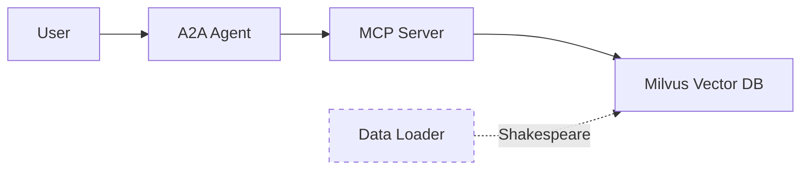

# RAG Agent Deployment

Deploy RAG agents locally or to IBM Code Engine.

## Quick Start

```bash
# Local deployment with Podman
./deploy.sh local

# IBM Code Engine deployment
./deploy.sh ibm-code-engine
```

## Deployment Options

### 1. Local Deployment

Deploy all services locally using Podman for development and testing.

**Features:**
- ✅ Complete local environment
- ✅ Fast iteration and debugging
- ✅ No cloud costs
- ✅ Automatic Shakespeare data loading
- ✅ All services in containers

**Requirements:**
- Podman and podman-compose
- Watsonx.ai credentials
- 4GB+ RAM available

**Quick Start:**
```bash
cd local
cp .env.example .env
# Edit .env with credentials
./deploy.sh
```

**Documentation:** [local/README.md](local/README.md)

### 2. IBM Code Engine Deployment

Deploy to IBM Cloud Code Engine for production workloads.

**Features:**
- ✅ Serverless container platform
- ✅ Auto-scaling
- ✅ High availability
- ✅ Managed infrastructure
- ✅ Automatic Shakespeare data loading via job

**Requirements:**
- IBM Cloud account
- IBM Cloud CLI with Code Engine plugin
- Container registry access
- Watsonx.ai credentials

**Quick Start:**
```bash
cd ibm-code-engine
cp .env.example .env
# Edit .env with credentials
./deploy-all.sh
```

**Documentation:** [ibm-code-engine/README.md](ibm-code-engine/README.md)

## Architecture

Both deployment options include:



### Components

1. **Milvus Vector Database**
   - Stores document embeddings
   - Enables semantic search
   - Includes etcd and MinIO (local only)

2. **MCP Server**
   - Provides RAG tools via REST API
   - Handles document processing
   - Generates embeddings with Watsonx.ai

3. **A2A Agent**
   - Orchestrates RAG workflows
   - Consumes MCP tools
   - Provides agent interface

4. **Data Loader**
   - Automatically loads Shakespeare text
   - Runs once during deployment
   - Job-based (Code Engine) or container (local)

## Comparison

| Feature | Local | IBM Code Engine |
|---------|-------|-----------------|
| Setup Time | 5 minutes | 15 minutes |
| Cost | Free (local resources) | Pay per use |
| Scalability | Limited to local machine | Auto-scaling |
| Availability | Single instance | High availability |
| Debugging | Easy (direct access) | Via logs |
| Data Persistence | Local volumes | Cloud storage |
| Best For | Development, testing | Production, demos |

## Configuration

Both deployments use similar environment variables:

```bash
# Watsonx.ai (Required)
WATSONX_API_KEY=your-api-key
WATSONX_PROJECT_ID=your-project-id

# Models (Optional)
EMBEDDING_MODEL=ibm/slate-125m-english-rtrvr
LLM_MODEL=ibm/granite-13b-chat-v2

# Milvus (Auto-configured)
MILVUS_HOST=milvus  # or external host
MILVUS_PORT=19530
MILVUS_COLLECTION_NAME=rag_knowledge_base
```

## Data Loading

Both deployments automatically load Shakespeare's complete works into Milvus:

**Local:**
- Runs as a container during deployment
- Uses `data-loader` service in podman-compose
- Checks if data exists before loading

**IBM Code Engine:**
- Runs as a Code Engine job
- Submitted automatically after deployment
- Can be re-run manually if needed

**Data Source:**
- File: `data/reference/complete works of Shakespear.txt`
- Processed into chunks with embeddings
- Indexed in Milvus for semantic search

## Testing

### Local

```bash
# Health checks
curl http://localhost:8000/health
curl http://localhost:8001/health

# Query Shakespeare
curl -X POST http://localhost:8000/tools/rag_query \
  -H "Content-Type: application/json" \
  -d '{"query": "What did Hamlet say about being?"}'
```

### IBM Code Engine

```bash
# Get URLs
MCP_URL=$(ibmcloud ce app get --name rag-mcp-server -o json | grep -o '"url":"[^"]*' | cut -d'"' -f4)
A2A_URL=$(ibmcloud ce app get --name rag-a2a-agent -o json | grep -o '"url":"[^"]*' | cut -d'"' -f4)

# Health checks
curl $MCP_URL/health
curl $A2A_URL/health

# Query Shakespeare
curl -X POST $MCP_URL/tools/rag_query \
  -H "Content-Type: application/json" \
  -d '{"query": "What did Hamlet say about being?"}'
```

## Troubleshooting

### Common Issues

**Milvus Connection Failed:**
- Local: Check if Milvus container is running
- Code Engine: Verify MILVUS_HOST environment variable

**Data Loader Failed:**
- Check if Shakespeare file exists in `data/reference/`
- View logs: `podman-compose logs data-loader` (local)
- View logs: `ibmcloud ce jobrun logs --job rag-data-loader` (Code Engine)

**Build Failures:**
- Ensure Podman is installed and running
- Check container registry credentials (Code Engine)
- Verify network connectivity

### Getting Help

1. Check service logs
2. Review configuration files
3. Consult component-specific READMEs
4. Check MkDocs documentation

## Documentation

Complete documentation available in MkDocs:

- **[RAG Overview](../../docs/docs/rag/overview.md)**
- **[Configuration Guide](../../docs/docs/rag/configuration.md)**
- **[API Reference](../../docs/docs/rag/api-reference.md)**
- **[Testing Guide](../../docs/docs/rag/testing.md)**
- **[Troubleshooting](../../docs/docs/rag/troubleshooting.md)**

## Directory Structure

```
deployment/
├── deploy.sh                    # Unified deployment script
├── README.md                    # This file
├── local/                       # Local deployment
│   ├── deploy.sh               # Local deployment script
│   ├── podman-compose.yml      # Podman compose configuration
│   ├── Containerfile.mcp       # MCP Server container
│   ├── Containerfile.a2a       # A2A Agent container
│   ├── Containerfile.loader    # Data loader container
│   ├── load_data.py            # Data loading script
│   ├── .env.example            # Environment template
│   └── README.md               # Local deployment docs
└── ibm-code-engine/            # IBM Code Engine deployment
    ├── deploy-all.sh           # Full deployment script
    ├── .env.example            # Environment template
    ├── README.md               # Code Engine deployment docs
    ├── mcp-server/             # MCP Server deployment
    ├── a2a-agent/              # A2A Agent deployment
    ├── milvus/                 # Milvus deployment (optional)
    └── data-loader/            # Data loader job
        ├── deploy.sh           # Job deployment script
        ├── Containerfile       # Job container
        └── load_data.py        # Data loading script
```

## Made with Bob