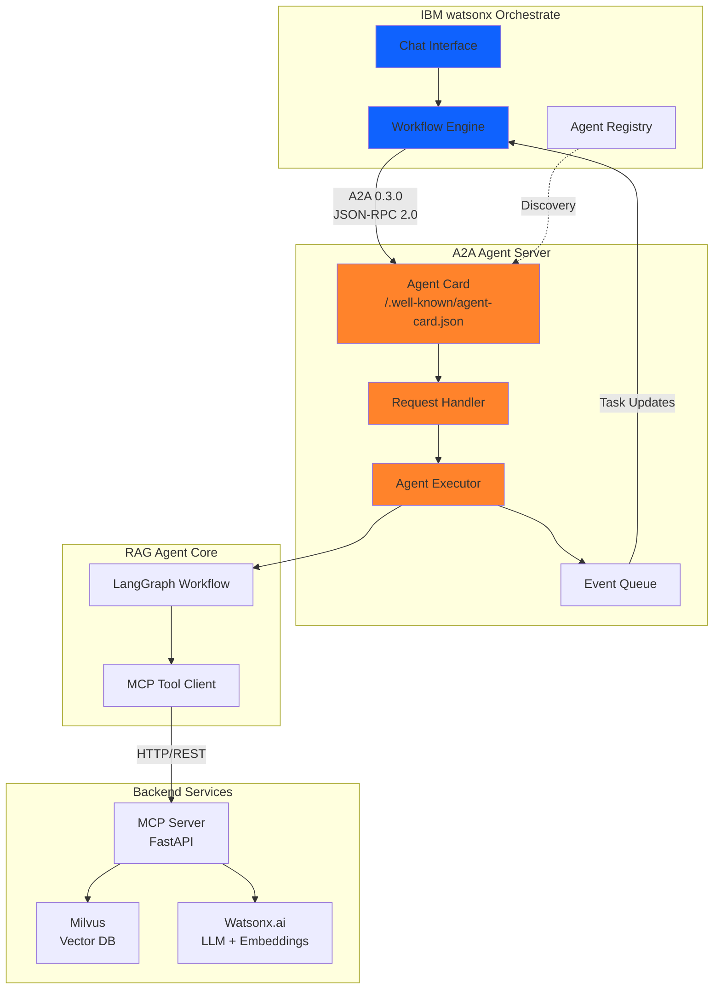

# AI Agents Project

Implementation of Agent-to-Agent (A2A) and Model Context Protocol (MCP) standards using IBM watsonx Orchestrate, featuring a production-ready RAG agent with Watsonx.ai and Milvus.

## Overview

This repository contains:

- **A2A RAG Agent**: Production implementation of A2A 0.3.0 protocol using `a2a-server` framework
- **IBM watsonx Orchestrate Integration**: Enterprise agent orchestration and workflow management
- **MCP Server**: RESTful API implementing Model Context Protocol
- **Watsonx.ai Integration**: IBM's AI platform for embeddings and LLM services
- **Milvus Vector Store**: High-performance semantic search
- **LangGraph Workflows**: Agent state machine orchestration

## Quick Start

```bash
cd RAG
./deployment/setup.sh
# Edit config/.env with Watsonx.ai credentials
./scripts/start_services.sh

# Test
curl -X POST http://localhost:8000/tools/rag_query \
  -H "Content-Type: application/json" \
  -d '{"query": "What is the A2A protocol?"}'
```

## Repository Structure

```
.
├── RAG/                    # A2A RAG Agent implementation
│   ├── agent/              # LangGraph-based A2A agent
│   ├── mcp_server/         # FastAPI MCP server
│   ├── services/           # Watsonx.ai, Milvus, document processing
│   ├── config/             # Configuration management
│   ├── deployment/         # Podman/Docker deployment
│   ├── scripts/            # Automation scripts
│   └── tests/              # Test suite (34 tests, 100% passing)
│
├── orchestrate/            # IBM watsonx Orchestrate integration
│   ├── rag-agent-config.yml  # Agent configuration
│   ├── scripts/            # Orchestrate startup scripts
│   └── .env                # Orchestrate credentials
│
└── docs/                   # MkDocs documentation
    └── docs/
        ├── rag/            # RAG agent documentation
        ├── architecture/   # System architecture
        ├── protocols/      # A2A and MCP specifications
        └── deployment/     # Deployment guides
```

## Architecture



## Documentation

Complete documentation is available at: **https://binnes.github.io/a2a/**

### RAG Agent
- [Overview](https://binnes.github.io/a2a/rag/overview/) - Architecture and components
- [Quick Start](https://binnes.github.io/a2a/rag/quickstart/) - Setup and configuration
- [API Reference](https://binnes.github.io/a2a/rag/api-reference/) - REST API documentation
- [Configuration](https://binnes.github.io/a2a/rag/configuration/) - Configuration options
- [Testing](https://binnes.github.io/a2a/rag/testing/) - Test suite documentation
- [Troubleshooting](https://binnes.github.io/a2a/rag/troubleshooting/) - Common issues

### Deployment
- [Local Deployment](https://binnes.github.io/a2a/deployment/local/) - Podman/Docker setup
- [IBM watsonx Orchestrate](https://binnes.github.io/a2a/deployment/orchestrate/) - Enterprise orchestration
- [IBM Code Engine](https://binnes.github.io/a2a/deployment/ibm-code-engine/) - Cloud deployment

### Platform
- [Architecture](https://binnes.github.io/a2a/architecture/overview/) - System architecture
- [IBM Orchestrate](https://binnes.github.io/a2a/architecture/orchestrate/) - Orchestration platform
- [MCP Protocol](https://binnes.github.io/a2a/protocols/mcp/) - Model Context Protocol
- [A2A Protocol](https://binnes.github.io/a2a/protocols/a2a/) - Agent-to-Agent Protocol

## Installation

### Prerequisites

- Python 3.11-3.13
- Podman or Docker
- IBM Watsonx.ai account (API key and project ID)

### Setup

1. Clone repository
   ```bash
   git clone https://github.com/binnes/a2a.git
   cd a2a
   ```

2. Configure RAG agent
   ```bash
   cd RAG
   ./deployment/setup.sh
   cp config/.env.example config/.env
   # Edit config/.env with your credentials
   ```

3. Start services
   ```bash
   ./scripts/start_services.sh
   ```

4. Verify installation
   ```bash
   curl http://localhost:8000/health
   ```

## Configuration

Key settings in `RAG/config/.env`:

```bash
# Watsonx.ai
WATSONX_API_KEY=your_api_key
WATSONX_PROJECT_ID=your_project_id
WATSONX_URL=https://us-south.ml.cloud.ibm.com

# Models
EMBEDDING_MODEL=ibm/granite-embedding-278m-multilingual
EMBEDDING_DIMENSION=768
LLM_MODEL=openai/gpt-oss-120b
LLM_MAX_TOKENS=16384

# RAG
RAG_CHUNK_SIZE=80          # words
RAG_CHUNK_OVERLAP=10       # words
RAG_TOP_K=5

# Milvus
MILVUS_HOST=localhost
MILVUS_PORT=19530
MILVUS_COLLECTION=rag_knowledge_base
```

## Testing

```bash
cd RAG

# Run all tests
./scripts/run_tests.sh

# Run specific test suites
pytest tests/test_document_processor.py -v
pytest tests/test_e2e_shakespeare.py -v

# Run by marker
pytest -m unit -v
pytest -m integration -v
```

Test results: 34/34 passing (100% coverage)

## Technology Stack

| Component | Technology |
|-----------|-----------|
| A2A Protocol | a2a-server (A2A 0.3.0) |
| Agent Framework | LangGraph |
| Orchestration | IBM watsonx Orchestrate |
| MCP Server | FastAPI |
| AI Platform | IBM Watsonx.ai |
| Vector Database | Milvus |
| Document Processing | PyPDF, python-docx |
| Deployment | Podman/Docker |
| Testing | pytest |
| Documentation | MkDocs Material |

## Performance

| Metric | Value |
|--------|-------|
| Document indexing | 0.37s for 196K lines |
| Query response | < 5 seconds |
| Concurrent queries | 10+ simultaneous |
| Vector search | < 1 second |

## Project Status

| Component | Status | Tests |
|-----------|--------|-------|
| A2A RAG Agent (0.3.0) | Complete | 34/34 passing |
| IBM Orchestrate Integration | Complete | Tested |
| MCP Server | Complete | 18/18 passing |
| Watsonx.ai Integration | Complete | Tested |
| Milvus Vector Store | Complete | Tested |
| LangGraph Workflows | Complete | Tested |

## Contributing

1. Fork the repository
2. Create a feature branch
3. Make changes with tests
4. Submit pull request

Development setup:
```bash
cd RAG
python -m venv venv
source venv/bin/activate
pip install -r requirements.txt
pytest tests/ -v
```

## Built With

This project was created using **[IBM Bob](https://github.com/ibm/bob)** - an AI-powered development assistant that helps build production-ready applications with best practices and comprehensive documentation.

## License

Apache License 2.0

## References

- [A2A Protocol Samples](https://github.com/a2aproject/a2a-samples)
- [Model Context Protocol](https://github.com/modelcontextprotocol)
- [IBM Watsonx.ai](https://www.ibm.com/products/watsonx-ai)
- [LangGraph](https://github.com/langchain-ai/langgraph)
- [Milvus](https://milvus.io/)