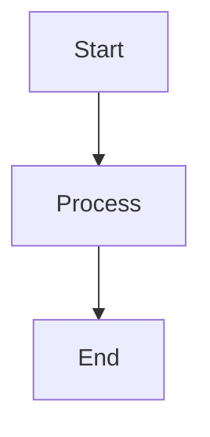

# AI Agents Project Documentation

This directory contains the complete documentation for the AI Agents project, built using [MkDocs](https://www.mkdocs.org/) with the [Material theme](https://squidfunk.github.io/mkdocs-material/).

## Prerequisites

Before building the documentation, ensure you have Python 3.8+ installed.

## Installation

Install the required dependencies:

```bash
pip install mkdocs mkdocs-material pymdown-extensions
```

Or use the requirements file if available:

```bash
pip install -r requirements-docs.txt
```

## Building the Documentation

### Local Development Server

To start a local development server with live reload:

```bash
cd docs
mkdocs serve
```

The documentation will be available at `http://127.0.0.1:8000`

### Build Static Site

To build the static HTML site:

```bash
cd docs
mkdocs build
```

The built site will be in the `site/` directory.

## Documentation Structure

```
docs/
├── mkdocs.yml                 # MkDocs configuration
├── index.md                   # Landing page
├── architecture/
│   ├── overview.md            # System architecture
│   └── orchestrate.md         # IBM Orchestrate integration
└── protocols/
    ├── mcp.md                 # Model Context Protocol
    └── a2a.md                 # Agent-to-Agent Protocol
```

## Features

The documentation includes:

- **Material Theme**: Modern, responsive design
- **Mermaid Diagrams**: Interactive architecture diagrams
- **Code Highlighting**: Syntax highlighting for multiple languages
- **Search**: Full-text search functionality
- **Dark Mode**: Toggle between light and dark themes
- **Navigation**: Organized navigation with tabs and sections

## Customization

### Theme Configuration

Edit `mkdocs.yml` to customize:

- Color scheme
- Navigation structure
- Features and extensions
- Social links

### Adding New Pages

1. Create a new Markdown file in the appropriate directory
2. Add the page to the `nav` section in `mkdocs.yml`
3. The page will automatically appear in the navigation

Example:

```yaml
nav:
  - Home: index.md
  - Your Section:
      - New Page: your-section/new-page.md
```

## Mermaid Diagrams

The documentation supports Mermaid diagrams for visualizing architecture and workflows:

````markdown

````

## Deployment

### GitHub Pages

To deploy to GitHub Pages:

```bash
mkdocs gh-deploy
```

### Custom Server

Copy the contents of the `site/` directory to your web server:

```bash
mkdocs build
rsync -av site/ user@server:/var/www/docs/
```

### Docker

Build and run in a Docker container:

```dockerfile
FROM python:3.11-slim

WORKDIR /docs

COPY requirements-docs.txt .
RUN pip install -r requirements-docs.txt

COPY . .

EXPOSE 8000

CMD ["mkdocs", "serve", "--dev-addr=0.0.0.0:8000"]
```

Build and run:

```bash
docker build -t ai-agents-docs .
docker run -p 8000:8000 ai-agents-docs
```

## Contributing

When contributing to the documentation:

1. Follow the existing structure and style
2. Use clear, concise language
3. Include code examples where appropriate
4. Test locally before committing
5. Update the navigation in `mkdocs.yml` if adding new pages

## Troubleshooting

### Issue: `mkdocs: command not found`

**Solution**: Ensure MkDocs is installed:
```bash
pip install mkdocs mkdocs-material
```

### Issue: Mermaid diagrams not rendering

**Solution**: Verify `pymdownx.superfences` is configured in `mkdocs.yml`:
```yaml
markdown_extensions:
  - pymdownx.superfences:
      custom_fences:
        - name: mermaid
          class: mermaid
          format: !!python/name:pymdownx.superfences.fence_code_format
```

### Issue: Changes not appearing

**Solution**: Clear the browser cache or use incognito mode. For the dev server, it should auto-reload.

## Resources

- [MkDocs Documentation](https://www.mkdocs.org/)
- [Material for MkDocs](https://squidfunk.github.io/mkdocs-material/)
- [Mermaid Documentation](https://mermaid.js.org/)
- [PyMdown Extensions](https://facelessuser.github.io/pymdown-extensions/)

## License

This documentation is part of the AI Agents project. See the main project LICENSE file for details.