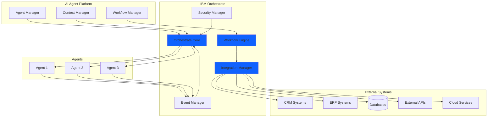

# IBM Orchestrate Integration

## Overview

**IBM Orchestrate** serves as the core platform for our AI agent system, providing enterprise-grade orchestration, workflow management, and integration capabilities. It acts as the central nervous system that coordinates agent activities, manages workflows, and connects to external services.

## Why IBM Orchestrate?

IBM Orchestrate was chosen as the foundation for several key reasons:

### Enterprise-Grade Reliability

- **High Availability**: Built-in redundancy and failover mechanisms
- **Scalability**: Handles thousands of concurrent workflows
- **Performance**: Optimized for low-latency operations
- **Monitoring**: Comprehensive observability and alerting

### Integration Capabilities

- **Pre-built Connectors**: Connect to 100+ enterprise systems
- **API Gateway**: Unified interface for external services
- **Data Transformation**: Built-in data mapping and transformation
- **Event Processing**: Real-time event handling and routing

### Workflow Management

- **Visual Designer**: Create workflows with drag-and-drop interface
- **Version Control**: Track and manage workflow versions
- **Testing Tools**: Built-in testing and debugging capabilities
- **Deployment**: Automated deployment pipelines

## Architecture Integration



## Key Features

### 1. Workflow Orchestration

IBM Orchestrate manages complex workflows that coordinate multiple agents and services:

```yaml
workflow:
  name: customer-inquiry-handler
  trigger: incoming-message
  steps:
    - name: classify-inquiry
      agent: classification-agent
      timeout: 5s
    
    - name: route-to-specialist
      agent: routing-agent
      input: ${classify-inquiry.output}
    
    - name: process-inquiry
      agent: ${route-to-specialist.specialist}
      input: ${classify-inquiry.context}
    
    - name: send-response
      action: send-message
      input: ${process-inquiry.response}
```

### 2. Agent Lifecycle Management

Orchestrate handles the complete agent lifecycle:

- **Provisioning**: Automatic agent deployment and configuration
- **Scaling**: Dynamic scaling based on workload
- **Health Monitoring**: Continuous health checks and recovery
- **Decommissioning**: Graceful shutdown and cleanup

### 3. Event-Driven Architecture

Support for event-driven patterns:

- **Event Subscriptions**: Agents subscribe to relevant events
- **Event Routing**: Intelligent routing based on event types
- **Event Transformation**: Convert events between formats
- **Event Replay**: Replay events for debugging or recovery

### 4. Security and Compliance

Enterprise security features:

- **Authentication**: OAuth 2.0, SAML, API keys
- **Authorization**: Role-based access control (RBAC)
- **Encryption**: End-to-end encryption for data in transit
- **Audit Logging**: Comprehensive audit trails
- **Compliance**: SOC 2, GDPR, HIPAA compliance

## Configuration

### Basic Configuration

```python
from orchestrate import OrchestratePlatform

# Initialize Orchestrate connection
orchestrate = OrchestratePlatform(
    api_key=os.getenv('ORCHESTRATE_API_KEY'),
    endpoint=os.getenv('ORCHESTRATE_ENDPOINT'),
    workspace_id=os.getenv('ORCHESTRATE_WORKSPACE_ID')
)

# Register an agent
orchestrate.register_agent(
    name='customer-service-agent',
    type='conversational',
    capabilities=['chat', 'email', 'ticket-management'],
    max_instances=10
)
```

### Advanced Configuration

```python
# Configure workflow with error handling
workflow = orchestrate.create_workflow(
    name='order-processing',
    retry_policy={
        'max_attempts': 3,
        'backoff': 'exponential',
        'initial_delay': 1000
    },
    error_handlers={
        'timeout': 'notify-admin',
        'validation_error': 'return-to-user',
        'system_error': 'escalate'
    }
)
```

## Integration Patterns

### 1. Request-Response Pattern

Synchronous communication for immediate responses:

```python
response = orchestrate.invoke_agent(
    agent_id='classification-agent',
    input={'text': 'Customer inquiry text'},
    timeout=5000
)
```

### 2. Fire-and-Forget Pattern

Asynchronous processing for long-running tasks:

```python
orchestrate.submit_task(
    agent_id='data-processing-agent',
    input={'dataset': 'large-dataset.csv'},
    callback_url='https://api.example.com/callback'
)
```

### 3. Pub-Sub Pattern

Event-driven communication:

```python
orchestrate.subscribe(
    agent_id='notification-agent',
    events=['order.created', 'order.updated'],
    handler=handle_order_event
)
```

## Monitoring and Observability

### Metrics

IBM Orchestrate provides comprehensive metrics:

- **Agent Performance**: Response times, success rates, error rates
- **Workflow Execution**: Duration, step completion, bottlenecks
- **Resource Usage**: CPU, memory, network utilization
- **Integration Health**: External service availability and latency

### Logging

Structured logging for debugging and analysis:

```python
orchestrate.logger.info(
    'Agent invoked',
    agent_id='customer-service-agent',
    request_id='req-12345',
    user_id='user-67890'
)
```

### Alerting

Configure alerts for critical events:

```python
orchestrate.create_alert(
    name='high-error-rate',
    condition='error_rate > 0.05',
    notification_channels=['email', 'slack'],
    severity='critical'
)
```

## Best Practices

### 1. Workflow Design

- Keep workflows modular and reusable
- Implement proper error handling
- Use timeouts to prevent hanging operations
- Design for idempotency

### 2. Agent Configuration

- Set appropriate resource limits
- Configure health checks
- Implement graceful degradation
- Use circuit breakers for external services

### 3. Security

- Rotate API keys regularly
- Use least-privilege access
- Encrypt sensitive data
- Implement rate limiting

### 4. Performance

- Cache frequently accessed data
- Use async operations where possible
- Implement connection pooling
- Monitor and optimize bottlenecks

## Troubleshooting

### Common Issues

**Issue**: Agent not responding

**Solution**: Check agent health status and logs in Orchestrate dashboard

**Issue**: Workflow timeout

**Solution**: Increase timeout values or optimize workflow steps

**Issue**: Integration failures

**Solution**: Verify external service credentials and network connectivity

## Resources

- [IBM Orchestrate Documentation](https://www.ibm.com/docs/orchestrate)
- [API Reference](../api/reference.md)
- [MCP Protocol](../protocols/mcp.md)
- [A2A Protocol](../protocols/a2a.md)