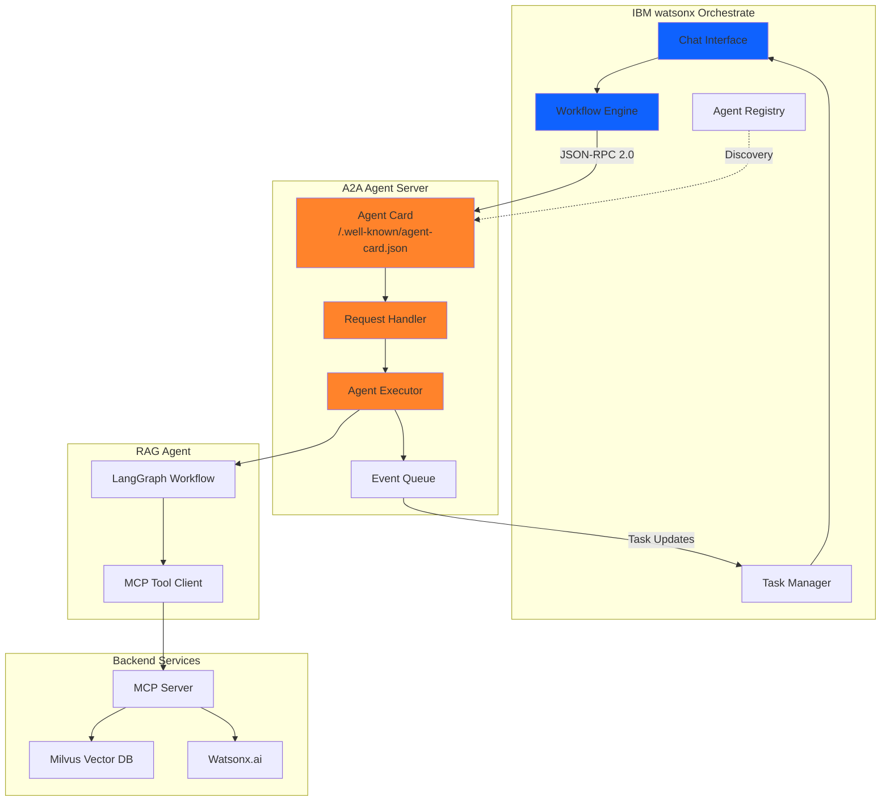

# IBM watsonx Orchestrate Integration

## Overview

**IBM watsonx Orchestrate** serves as the orchestration platform for our AI agent system, providing enterprise-grade workflow management and agent coordination. The Shakespeare RAG Agent integrates with Orchestrate using the **A2A 0.3.0 protocol** via the official `a2a-server` framework.

## Why IBM watsonx Orchestrate?

IBM watsonx Orchestrate was chosen as the orchestration platform for several key reasons:

### Enterprise-Grade Platform

- **Proven Reliability**: Production-ready platform from IBM
- **Scalability**: Handles multiple concurrent agent interactions
- **Developer Edition**: Local development and testing support
- **Cloud Deployment**: Enterprise deployment options available

### A2A Protocol Support

- **Standards-Based**: Native support for A2A 0.3.0 protocol
- **Agent Discovery**: Automatic agent registration and discovery
- **Task Management**: Built-in task lifecycle management
- **Streaming Updates**: Real-time progress updates during execution

### Integration Features

- **Chat Interface**: User-friendly interface for agent interaction
- **Workflow Builder**: Create multi-agent workflows
- **Monitoring**: Built-in observability and logging
- **Security**: Enterprise-grade authentication and authorization

## Architecture Integration



## Agent Registration

### Using Orchestrate CLI

Register the Shakespeare RAG Agent with Orchestrate:

```bash
# Activate orchestrate virtual environment
source .venv/bin/activate

# Create and import the agent
orchestrate agents create \
  -n shakespeare-rag-agent \
  -t "Shakespeare Knowledge Agent" \
  -k external \
  --description "RAG agent with complete works of Shakespeare. Use for questions about Shakespeare's plays, sonnets, characters, quotes, and literary analysis." \
  --api http://host.lima.internal:8001 \
  --provider external_chat/A2A/0.3.0 \
  -o rag-agent-config.yml
```

**Important Notes:**
- Use `host.lima.internal` to access the host machine from Lima VM where Orchestrate runs
- The agent must be running on `http://localhost:8001` before registration
- Configuration is saved to `rag-agent-config.yml` for future reference

### Agent Configuration File

The generated configuration file (`rag-agent-config.yml`) contains:

```yaml
name: shakespeare-rag-agent
title: Shakespeare Knowledge Agent
kind: external
description: RAG agent with complete works of Shakespeare
api: http://host.lima.internal:8001
provider: external_chat/A2A/0.3.0
```

### Verifying Registration

```bash
# List imported agents
orchestrate agents list

# Test agent health
curl http://localhost:8001/health

# View agent card
curl http://localhost:8001/.well-known/agent-card.json
```

## Agent Capabilities

The Shakespeare RAG Agent exposes the following capabilities through its agent card:

### Skills

- **ID**: `shakespeare_knowledge`
- **Name**: Shakespeare Knowledge Base
- **Description**: Search and answer questions about Shakespeare's complete works
- **Tags**: shakespeare, literature, plays, sonnets, poetry, drama, elizabethan

### Example Queries

- "Who is Hamlet?"
- "What are the main characters in Othello?"
- "Tell me about Romeo and Juliet"
- "What happens in Macbeth?"
- "Who wrote 'To be or not to be'?"

### Input/Output Modes

- **Input**: text, text/plain
- **Output**: text, text/plain

### Capabilities

- **Streaming**: Not supported (synchronous responses)
- **Push Notifications**: Not supported

## Using the Agent

### Through Orchestrate UI

Once registered, the agent is available in the Orchestrate chat interface:

1. Open IBM watsonx Orchestrate Developer Edition
2. Navigate to the chat interface
3. Type a question about Shakespeare
4. The agent will process the query and return an answer with sources

### Example Interaction

```
User: Who is Hamlet?

Agent: Searching Shakespeare's works for relevant information...

Agent: Hamlet is the Prince of Denmark and the protagonist of William
Shakespeare's tragedy "Hamlet." He is the son of the late King Hamlet
and Queen Gertrude. The play follows Hamlet as he seeks to avenge his
father's murder by his uncle Claudius, who has married Gertrude and
taken the throne...

[Sources: Hamlet, Act I, Scene II; Hamlet, Act III, Scene I]
```

### In Workflows

The agent can be included in Orchestrate workflows:

```yaml
workflow:
  name: literary-analysis
  steps:
    - name: query-shakespeare
      agent: shakespeare-rag-agent
      input: ${user.question}
    
    - name: summarize
      agent: summarization-agent
      input: ${query-shakespeare.response}
    
    - name: present-results
      action: send-message
      input: ${summarize.output}
```

## Monitoring and Debugging

### Agent Logs

View agent logs in the Orchestrate interface or via CLI:

```bash
# View agent logs
orchestrate agents logs shakespeare-rag-agent

# Follow logs in real-time
orchestrate agents logs shakespeare-rag-agent --follow
```

### Health Checks

The agent exposes a health endpoint:

```bash
# Check agent health
curl http://localhost:8001/health

# Expected response
{
  "agent": true,
  "mcp_server": true
}
```

### Task Status

Monitor task execution through Orchestrate:

- **pending**: Task created, waiting to start
- **working**: Agent is processing the query
- **completed**: Task finished successfully
- **failed**: Task encountered an error

### Performance Metrics

Key metrics to monitor:

- **Response Time**: Average time to process queries
- **Success Rate**: Percentage of successful completions
- **Error Rate**: Percentage of failed queries
- **Throughput**: Queries processed per minute

## Deployment Options

### Local Development

Use Orchestrate Developer Edition for local development:

```bash
# Start Orchestrate
cd orchestrate
bash scripts/startOrchestrate.sh

# Start RAG agent
cd RAG/deployment/local
bash deploy.sh

# Register agent
orchestrate agents create -n shakespeare-rag-agent ...
```

### Production Deployment

For production deployments:

1. **Deploy RAG Agent**: Use IBM Code Engine or Kubernetes
2. **Configure Networking**: Ensure Orchestrate can reach the agent
3. **Set Environment Variables**: Configure API keys and endpoints
4. **Register Agent**: Use production agent URL
5. **Monitor**: Set up logging and alerting

### Environment Variables

Required environment variables for the agent:

```bash
# Watsonx.ai Configuration
WATSONX_APIKEY=your-api-key
WATSONX_PROJECT_ID=your-project-id
WATSONX_URL=https://us-south.ml.cloud.ibm.com

# A2A Configuration
A2A_AGENT_ID=shakespeare-rag-agent
A2A_AGENT_NAME="Shakespeare Knowledge Agent"
A2A_HOST=0.0.0.0
A2A_PORT=8001

# MCP Server Configuration
MCP_SERVER_HOST=mcp-server
MCP_SERVER_PORT=8000
```

## Troubleshooting

### Agent Not Responding

**Symptoms**: Queries timeout or return no response

**Solutions**:
1. Check if agent is running: `curl http://localhost:8001/health`
2. Verify MCP server is accessible
3. Check agent logs for errors
4. Ensure network connectivity between Orchestrate and agent

### Registration Failed

**Symptoms**: Agent registration command fails

**Solutions**:
1. Verify Orchestrate is running: `orchestrate server status`
2. Check agent is accessible from Orchestrate VM
3. Use `host.lima.internal` for Lima VM deployments
4. Verify agent card is accessible: `curl http://localhost:8001/.well-known/agent-card.json`

### Query Errors

**Symptoms**: Agent returns errors for queries

**Solutions**:
1. Check MCP server logs
2. Verify Watsonx.ai credentials
3. Ensure Milvus vector database is running
4. Check knowledge base has been indexed

### Performance Issues

**Symptoms**: Slow response times

**Solutions**:
1. Monitor resource usage (CPU, memory)
2. Check network latency
3. Optimize vector search parameters
4. Scale backend services if needed

## Resources

- [IBM watsonx Orchestrate Documentation](https://www.ibm.com/docs/en/watsonx/orchestrate)
- [A2A Protocol](../protocols/a2a.md)
- RAG Agent Implementation: `RAG/agent/a2a_agent.py`
- Agent Executor: `RAG/agent/agent_executor.py`
- Orchestrate README: `orchestrate/README.md`
- [Deployment Guide](../deployment/orchestrate.md)