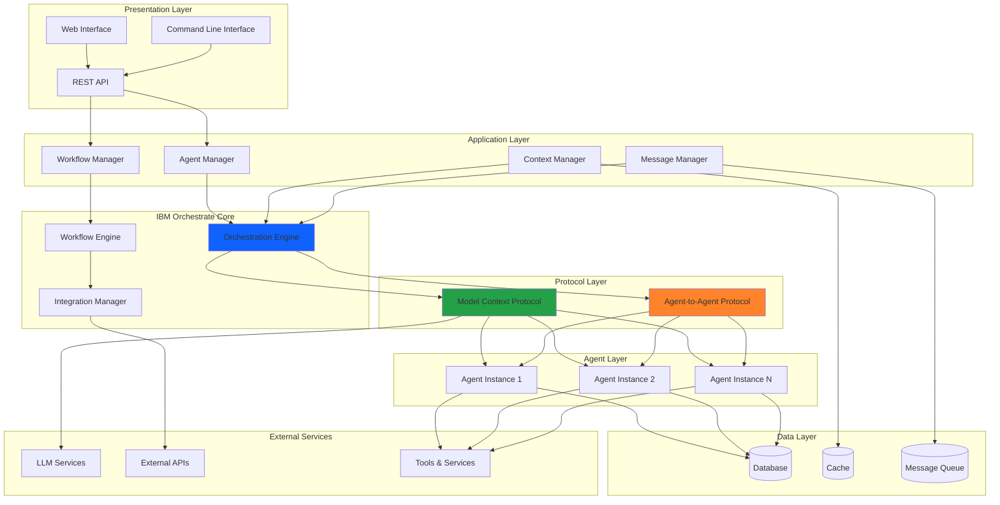

# Architecture Overview

## System Architecture

The AI Agents platform is built on a modular, scalable architecture that leverages **IBM Orchestrate** as its core orchestration engine. The system is designed to support multiple autonomous agents that can communicate, collaborate, and integrate with external services.

## High-Level Architecture

## Core Components

### 1. Presentation Layer

The presentation layer provides multiple interfaces for interacting with the platform:

- **Web Interface**: User-friendly dashboard for managing agents
- **REST API**: Programmatic access for integrations
- **CLI**: Command-line tools for developers and administrators

### 2. Application Layer

The application layer contains the business logic:

- **Agent Manager**: Handles agent lifecycle (creation, deployment, monitoring)
- **Workflow Manager**: Orchestrates complex multi-step processes
- **Context Manager**: Maintains state and context across interactions
- **Message Manager**: Routes and manages inter-agent communication

### 3. IBM Orchestrate Core

IBM Orchestrate provides the foundation:

- **Orchestration Engine**: Coordinates agent activities and workflows
- **Workflow Engine**: Executes predefined and dynamic workflows
- **Integration Manager**: Connects to external systems and services

### 4. Protocol Layer

Two key protocols enable agent functionality:

- **Model Context Protocol (MCP)**: Standardizes AI model interactions
- **Agent-to-Agent Protocol (A2A)**: Facilitates inter-agent communication

### 5. Agent Layer

Individual agent instances that:

- Execute specific tasks and responsibilities
- Maintain their own state and context
- Communicate with other agents
- Integrate with external tools and services

### 6. Data Layer

Persistent storage and caching:

- **Database**: Stores agent configurations, logs, and state
- **Cache**: Improves performance for frequently accessed data
- **Message Queue**: Ensures reliable asynchronous communication

## Design Principles

### Modularity

Each component is designed to be independent and replaceable, allowing for:

- Easy maintenance and updates
- Component-level scaling
- Technology stack flexibility

### Scalability

The architecture supports horizontal scaling:

- Multiple agent instances can run concurrently
- Load balancing across agent pools
- Distributed processing capabilities

### Reliability

Built-in resilience features:

- Automatic retry mechanisms
- Circuit breakers for external services
- State persistence and recovery

### Security

Security is integrated at every layer:

- Authentication and authorization
- Encrypted communication
- Audit logging
- Secure credential management

## Communication Patterns

### Synchronous Communication

Used for immediate responses:

- REST API calls
- Direct agent-to-agent messages
- Real-time user interactions

### Asynchronous Communication

Used for long-running tasks:

- Message queue processing
- Background job execution
- Event-driven workflows

## Deployment Models

### Single Instance

Suitable for development and testing:

- All components on one machine
- Simplified configuration
- Easy debugging

### Distributed

Recommended for production:

- Components across multiple servers
- Load balancing and redundancy
- High availability configuration

### Cloud-Native

Optimized for cloud platforms:

- Containerized deployments
- Auto-scaling capabilities
- Managed services integration

## Next Steps

- Learn more about [IBM Orchestrate Integration](orchestrate.md)
- Explore the [MCP Protocol](../protocols/mcp.md)
- Understand [A2A Communication](../protocols/a2a.md)