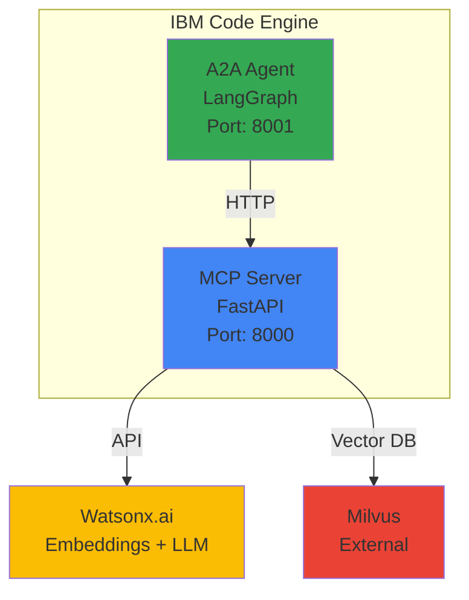

# IBM Code Engine Deployment

This guide covers deploying the RAG agents (MCP Server and A2A Agent) to IBM Code Engine.

## Overview

The deployment package provides a complete, production-ready solution for containerizing and deploying both the MCP Server and A2A Agent to IBM Cloud Code Engine using Red Hat UBI 10 micro base images.

## Architecture



## Prerequisites

### Required Services

1. **IBM Cloud Account** with access to:
   - IBM Cloud Container Registry
   - IBM Code Engine
   - IBM Watsonx.ai

2. **IBM Cloud CLI** with plugins:
   ```bash
   ibmcloud plugin install container-registry
   ibmcloud plugin install code-engine
   ```

3. **Podman** (or Docker) installed locally

4. **External Milvus Instance** for vector storage

### Required Credentials

- IBM Cloud API key
- Watsonx.ai API key and project ID
- Milvus host and port
- Container Registry namespace

## Quick Start

### 1. Configure Environment

```bash
cd RAG/deployment/ibm-code-engine

# Copy environment template
cp .env.example .env

# Edit with your credentials
nano .env
```

### 2. Deploy Services

```bash
# Deploy both MCP Server and A2A Agent
./deploy-all.sh

# Or deploy individually
cd mcp-server && ./deploy.sh
cd a2a-agent && ./deploy.sh
```

### 3. Verify Deployment

```bash
# List applications
ibmcloud ce application list

# Check health
curl https://rag-mcp-server.your-region.codeengine.appdomain.cloud/health

# View logs
ibmcloud ce application logs -n rag-mcp-server
```

## Configuration

### Environment Variables

#### Required Variables

| Variable | Description | Example |
|----------|-------------|---------|
| `IBM_RESOURCE_GROUP` | IBM Cloud resource group | `default` |
| `IBM_REGION` | IBM Cloud region for container registry | `eu-gb` |
| `IBM_ICR` | Container registry URL | `uk.icr.io` |
| `IBM_NAMESPACE` | Registry namespace | `my-namespace` |
| `IBM_ICE_PROJECT` | Code Engine project name | `rag-project` |
| `IBM_API_KEY` | IBM Cloud API key | `xxx` |
| `WATSONX_API_KEY` | Watsonx.ai API key | `xxx` |
| `WATSONX_PROJECT_ID` | Watsonx.ai project ID | `xxx` |
| `WATSONX_URL` | Watsonx.ai endpoint | `https://us-south.ml.cloud.ibm.com` |
| `DEPLOY_MILVUS_LOCAL` | Deploy Milvus to Code Engine | `false` |
| `MILVUS_HOST` | Milvus host (external or `rag-milvus` if local) | `milvus.example.com` |
| `MILVUS_PORT` | Milvus port | `19530` |

#### Optional Variables

| Variable | Description | Default |
|----------|-------------|---------|
| `EMBEDDING_MODEL` | Embedding model | `ibm/slate-125m-english-rtrvr` |
| `EMBEDDING_DIMENSION` | Vector dimension | `384` |
| `LLM_MODEL` | LLM model | `ibm/granite-13b-chat-v2` |
| `LLM_MAX_TOKENS` | Max tokens | `2048` |
| `LLM_TEMPERATURE` | Temperature | `0.7` |
| `RAG_CHUNK_SIZE` | Chunk size | `512` |
| `RAG_CHUNK_OVERLAP` | Chunk overlap | `50` |
| `RAG_TOP_K` | Top K results | `5` |
| `RAG_SCORE_THRESHOLD` | Score threshold | `0.7` |
| `LOG_LEVEL` | Logging level | `INFO` |

## Deployment Components

### MCP Server

The MCP Server provides the RESTful API for RAG operations.

**Container Specifications:**
- Base: Red Hat UBI 10 micro
- Port: 8000
- Resources: 1 vCPU, 2GB RAM
- Scaling: 1-3 instances
- Health check: `/health` endpoint

**Key Features:**
- FastAPI-based REST API
- 9 RAG tool endpoints
- Watsonx.ai integration
- Milvus vector storage
- Document processing (PDF, DOCX, TXT, MD)

### A2A Agent

The A2A Agent orchestrates RAG workflows using LangGraph.

**Container Specifications:**
- Base: Red Hat UBI 10 micro
- Port: 8001
- Resources: 1 vCPU, 2GB RAM
- Scaling: 1-3 instances
- Health check: Python-based

**Key Features:**
- LangGraph workflow orchestration
- A2A protocol support
- MCP tool client
- State management
- Error handling

## Deployment Process

### MCP Server Deployment

The `mcp-server/deploy.sh` script:

1. Validates environment variables
2. Authenticates with IBM Cloud
3. Builds container image with Podman
4. Pushes to IBM Container Registry
5. Creates/updates Code Engine application
6. Configures environment variables
7. Tests health endpoint
8. Reports deployment status

### A2A Agent Deployment

The `a2a-agent/deploy.sh` script:

1. Validates environment variables
2. Authenticates with IBM Cloud
3. Builds container image with Podman
4. Pushes to IBM Container Registry
5. Creates/updates Code Engine application
6. Configures environment variables
7. Links to MCP Server
8. Reports deployment status

### Master Deployment

The `deploy-all.sh` script orchestrates both deployments:

1. Deploys MCP Server
2. Waits for MCP Server readiness (30s)
3. Deploys A2A Agent
4. Provides deployment summary

## Container Images

### Multi-Stage Build

Both containers use multi-stage builds for minimal image size:

```dockerfile
# Stage 1: Build environment
FROM registry.access.redhat.com/ubi10 AS build
# Install dependencies and build application

# Stage 2: Minimal runtime
FROM scratch AS image
# Copy only runtime artifacts
```

**Benefits:**
- Minimal image size
- Reduced attack surface
- Faster deployment
- Lower storage costs

### Security Features

- Non-root user (UID 1001)
- Minimal base image (UBI micro)
- No shell or package manager
- Read-only root filesystem compatible

## Scaling

### Auto-Scaling Configuration

Both services auto-scale based on load:

- **Minimum instances**: 1
- **Maximum instances**: 3
- **CPU**: 1 vCPU per instance
- **Memory**: 2 GB per instance

### Modify Scaling

```bash
# Update MCP Server
ibmcloud ce application update rag-mcp-server \
  --min-scale 2 --max-scale 5 \
  --cpu 2 --memory 4G

# Update A2A Agent
ibmcloud ce application update rag-a2a-agent \
  --min-scale 2 --max-scale 5 \
  --cpu 2 --memory 4G
```

### Scale to Zero

For development environments, you can enable scale-to-zero:

```bash
ibmcloud ce application update rag-mcp-server --min-scale 0
```

!!! warning "Production Consideration"
    Scale-to-zero is not recommended for production as it introduces cold start latency.

## Monitoring

### Application Logs

```bash
# Real-time logs
ibmcloud ce application logs -n rag-mcp-server -f
ibmcloud ce application logs -n rag-a2a-agent -f

# Recent logs (last 100 lines)
ibmcloud ce application logs -n rag-mcp-server --tail 100
```

### Application Status

```bash
# Detailed status
ibmcloud ce application get -n rag-mcp-server
ibmcloud ce application get -n rag-a2a-agent

# List all applications
ibmcloud ce application list

# Application events
ibmcloud ce application events -n rag-mcp-server
```

### Health Checks

```bash
# MCP Server health
curl https://rag-mcp-server.your-region.codeengine.appdomain.cloud/health

# Expected response
{
  "status": "healthy",
  "components": {
    "watsonx": true,
    "milvus": true,
    "document_processor": true
  }
}

# MCP Server statistics
curl https://rag-mcp-server.your-region.codeengine.appdomain.cloud/tools/rag_stats
```

## Troubleshooting

### Container Build Issues

**Problem**: Build fails with dependency errors

```bash
# Clean build cache
podman system prune -a

# Rebuild with no cache
podman build -f Containerfile --no-cache .

# Check Podman version
podman --version  # Should be 4.0+
```

### Deployment Failures

**Problem**: Deployment script fails

```bash
# Verify IBM Cloud login
ibmcloud target

# Check Code Engine project
ibmcloud ce project list
ibmcloud ce project select --name your-project

# Verify registry access
ibmcloud cr login
ibmcloud cr namespace-list
```

### Application Not Starting

**Problem**: Application shows as failed

```bash
# Check application logs
ibmcloud ce application logs -n rag-mcp-server

# Check application events
ibmcloud ce application events -n rag-mcp-server

# Verify environment variables
ibmcloud ce application get -n rag-mcp-server -o yaml
```

### Milvus Connection Issues

**Problem**: Cannot connect to Milvus

- Verify Milvus is accessible from Code Engine
- Check `MILVUS_HOST` and `MILVUS_PORT` in `.env`
- Test connectivity: `curl http://MILVUS_HOST:MILVUS_PORT/health`
- Ensure firewall rules allow Code Engine egress

### Debug Mode

Enable debug logging:

```bash
ibmcloud ce application update rag-mcp-server \
  --env LOG_LEVEL=DEBUG
```

## Updates and Rollbacks

### Update Deployment

```bash
# Update MCP Server
cd mcp-server && ./deploy.sh

# Update A2A Agent
cd a2a-agent && ./deploy.sh
```

The deployment script automatically:
- Builds new container image with timestamp tag
- Pushes to registry
- Updates Code Engine application
- Performs health check

### Rollback to Previous Version

```bash
# List application revisions
ibmcloud ce application revisions -n rag-mcp-server

# Rollback to specific revision
ibmcloud ce application update rag-mcp-server \
  --revision rag-mcp-server-00002
```

### View Revision History

```bash
# Get revision details
ibmcloud ce revision get rag-mcp-server-00003

# Compare revisions
ibmcloud ce revision get rag-mcp-server-00002 -o yaml > rev2.yaml
ibmcloud ce revision get rag-mcp-server-00003 -o yaml > rev3.yaml
diff rev2.yaml rev3.yaml
```

## Security

### Best Practices

1. **Secrets Management**
   - Never commit `.env` file to version control
   - Use IBM Cloud Secrets Manager for production
   - Rotate credentials regularly (90 days)

2. **Network Security**
   - Use private endpoints where possible
   - Configure appropriate firewall rules
   - Enable TLS/SSL for all connections

3. **Access Control**
   - Apply least privilege principle
   - Use IAM roles appropriately
   - Enable audit logging
   - Review access regularly

4. **Container Security**
   - Non-root containers (UID 1001)
   - Minimal base images
   - No shell or package manager
   - Regular security updates

### Secrets in Code Engine

For production, use Code Engine secrets:

```bash
# Create secret from file
ibmcloud ce secret create --name rag-secrets \
  --from-env-file .env

# Update application to use secret
ibmcloud ce application update rag-mcp-server \
  --env-from-secret rag-secrets
```

## Cost Optimization

### Right-Sizing Resources

Monitor actual usage and adjust:

```bash
# View metrics
ibmcloud ce application get -n rag-mcp-server

# Adjust based on usage
ibmcloud ce application update rag-mcp-server \
  --cpu 0.5 --memory 1G  # Reduce for lower load
```

### Scaling Strategy

- **Development**: `--min-scale 0` (scale to zero)
- **Staging**: `--min-scale 1 --max-scale 2`
- **Production**: `--min-scale 2 --max-scale 5`

### Image Optimization

Already implemented:
- Multi-stage builds
- Minimal base images (UBI micro)
- Optimized dependencies
- No unnecessary packages

## Cleanup

### Delete Applications

```bash
# Delete MCP Server
ibmcloud ce application delete -n rag-mcp-server -f

# Delete A2A Agent
ibmcloud ce application delete -n rag-a2a-agent -f

# Delete registry secret
ibmcloud ce secret delete -n rag-registry-secret -f
```

### Delete Container Images

```bash
# List images
ibmcloud cr image-list --restrict your-namespace

# Delete specific image
ibmcloud cr image-rm de.icr.io/your-namespace/rag-mcp-server:20260119120000

# Delete all images for a repository
ibmcloud cr image-rm de.icr.io/your-namespace/rag-mcp-server --force
```

### Complete Cleanup

```bash
# Delete all RAG resources
ibmcloud ce application delete -n rag-mcp-server -f
ibmcloud ce application delete -n rag-a2a-agent -f
ibmcloud ce secret delete -n rag-registry-secret -f

# Clean local images
podman rmi $(podman images | grep rag- | awk '{print $3}')
```

## API Endpoints

### MCP Server Endpoints

Base URL: `https://rag-mcp-server.your-region.codeengine.appdomain.cloud`

| Endpoint | Method | Description |
|----------|--------|-------------|
| `/` | GET | Server information |
| `/health` | GET | Health check |
| `/docs` | GET | API documentation (Swagger) |
| `/tools` | GET | List available tools |
| `/tools/rag_query` | POST | Query with LLM generation |
| `/tools/rag_search` | POST | Semantic search only |
| `/tools/rag_index` | POST | Index single document |
| `/tools/rag_index_directory` | POST | Index directory |
| `/tools/rag_stats` | GET | Knowledge base statistics |
| `/tools/rag_clear` | DELETE | Clear knowledge base |

### Example API Calls

```bash
# Query endpoint
curl -X POST https://rag-mcp-server.your-region.codeengine.appdomain.cloud/tools/rag_query \
  -H "Content-Type: application/json" \
  -d '{
    "query": "What is the A2A protocol?",
    "top_k": 5,
    "include_sources": true
  }'

# Search endpoint
curl -X POST https://rag-mcp-server.your-region.codeengine.appdomain.cloud/tools/rag_search \
  -H "Content-Type: application/json" \
  -d '{
    "query": "agent communication",
    "top_k": 3
  }'

# Stats endpoint
curl https://rag-mcp-server.your-region.codeengine.appdomain.cloud/tools/rag_stats
```

## Performance Tuning

### Optimize Response Time

1. **Increase Resources**
   ```bash
   ibmcloud ce application update rag-mcp-server \
     --cpu 2 --memory 4G
   ```

2. **Increase Min Scale**
   ```bash
   ibmcloud ce application update rag-mcp-server \
     --min-scale 2
   ```

3. **Optimize RAG Parameters**
   - Reduce `RAG_TOP_K` for faster queries
   - Increase `RAG_SCORE_THRESHOLD` for better quality
   - Adjust `RAG_CHUNK_SIZE` based on content

### Monitor Performance

```bash
# View application metrics
ibmcloud ce application get -n rag-mcp-server

# Check response times in logs
ibmcloud ce application logs -n rag-mcp-server | grep "response_time"
```

## Support

- **Documentation**: This guide and [RAG Overview](../rag/overview.md)
- **IBM Cloud Docs**: [Code Engine Documentation](https://cloud.ibm.com/docs/codeengine)
- **Troubleshooting**: [RAG Troubleshooting](../rag/troubleshooting.md)
- **API Reference**: [RAG API Reference](../rag/api-reference.md)

## Next Steps

1. Review [RAG Overview](../rag/overview.md) for system architecture
2. See [RAG Configuration](../rag/configuration.md) for tuning options
3. Check [RAG Testing](../rag/testing.md) for validation procedures
4. Consult [RAG Troubleshooting](../rag/troubleshooting.md) for common issues