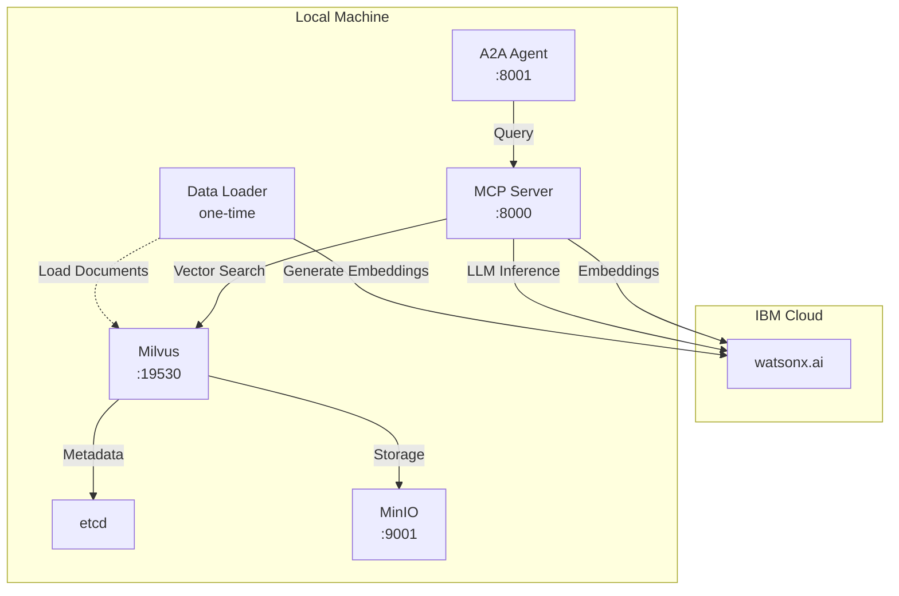

# Local Deployment

Deploy RAG agents locally using Podman for development and testing.

## Overview

Local deployment provides a complete RAG environment with containers running on your machine using Podman. The system uses **watsonx.ai** (IBM Cloud) for embedding generation and LLM inferencing, while vector storage and search run locally. This is ideal for:

- Development and testing
- Learning the system
- Cost-effective experimentation (only pay for watsonx.ai API usage)
- Local data processing with cloud AI capabilities

## Architecture



**Key Components:**

- **watsonx.ai (IBM Cloud)**: Provides embedding generation and LLM inferencing
  - Embedding Model: `ibm/granite-embedding-278m-multilingual`
  - LLM Model: `openai/gpt-oss-120b`
- **Local Containers**: Run on your machine using Podman
  - A2A Agent: Agent-to-Agent protocol interface
  - MCP Server: Model Context Protocol server with RAG tools
  - Milvus: Vector database for semantic search
  - etcd: Metadata storage for Milvus
  - MinIO: Object storage for Milvus
  - Data Loader: One-time job to load and index documents

## Prerequisites

### Required Software

1. **Podman** - Container runtime
   ```bash
   # macOS
   brew install podman
   
   # Linux (Fedora/RHEL)
   sudo dnf install podman
   
   # Linux (Ubuntu/Debian)
   sudo apt-get install podman
   ```

2. **podman-compose** - Compose tool
   ```bash
   pip3 install podman-compose
   ```

3. **Python 3.10+** - For local development
   ```bash
   python3 --version
   ```

### Required Credentials

- **Watsonx.ai API Key** - From IBM Cloud
- **Watsonx.ai Project ID** - From your Watsonx.ai project

## Quick Start

```bash
# Navigate to deployment directory
cd RAG/deployment

# Deploy locally
./deploy.sh local
```

Or directly:

```bash
cd RAG/deployment/local
cp .env.example .env
# Edit .env with your credentials
./deploy.sh
```

## Configuration

### Environment Variables

Create `.env` from `.env.example`:

```bash
# Watsonx.ai Configuration (Required)
WATSONX_API_KEY=your-api-key-here
WATSONX_PROJECT_ID=your-project-id-here
WATSONX_URL=https://us-south.ml.cloud.ibm.com

# Embedding Model Configuration
EMBEDDING_MODEL=ibm/granite-embedding-278m-multilingual
EMBEDDING_DIMENSION=768

# LLM Configuration
LLM_MODEL=openai/gpt-oss-120b
LLM_MAX_TOKENS=16384
LLM_TEMPERATURE=0.7

# Milvus Configuration
MILVUS_HOST=milvus
MILVUS_PORT=19530
MILVUS_COLLECTION_NAME=rag_knowledge_base
MILVUS_METRIC_TYPE=COSINE

# RAG Configuration
RAG_CHUNK_SIZE=512
RAG_CHUNK_OVERLAP=50
RAG_TOP_K=5
RAG_SCORE_THRESHOLD=0.7

# Logging
LOG_LEVEL=INFO
```

## Deployment Process

The deployment script performs these steps:

1. **Validate Prerequisites**
   - Check Podman installation
   - Check podman-compose installation
   - Verify .env configuration

2. **Start Milvus Stack**
   - Start etcd (metadata store)
   - Start MinIO (object storage)
   - Start Milvus (vector database)
   - Wait for health checks

3. **Build and Start MCP Server**
   - Build container from Containerfile
   - Start MCP Server
   - Wait for health check

4. **Build and Start A2A Agent**
   - Build container from Containerfile
   - Start A2A Agent
   - Wait for health check

5. **Load Shakespeare Data**
   - Build data loader container
   - Process Shakespeare text
   - Generate embeddings via watsonx.ai
   - Index embeddings in Milvus

## Service Endpoints

After deployment, services are available at:

| Service | Endpoint | Description |
|---------|----------|-------------|
| MCP Server | http://localhost:8000 | RAG tools API |
| MCP Health | http://localhost:8000/health | Health check |
| A2A Agent | http://localhost:8001 | Agent API |
| A2A Health | http://localhost:8001/health | Health check |
| Milvus | localhost:19530 | Vector database |
| MinIO Console | http://localhost:9001 | Object storage UI |

## IBM watsonx Orchestrate Integration

Once the RAG agent is deployed locally, you can integrate it with IBM watsonx Orchestrate Developer Edition for enterprise-grade orchestration and workflow management.

### Prerequisites

1. **Orchestrate Developer Edition**: Download and install from [IBM Developer](https://developer.watson-orchestrate.ibm.com)
2. **Entitlement Key**: Obtain from IBM Marketplace (wxo/myibm)
3. **Running RAG Agent**: Ensure the A2A agent is running on http://localhost:8001

### Setup Orchestrate

1. **Configure Environment**:
   ```bash
   cd orchestrate
   cp .env.example .env
   # Edit .env with your credentials
   ```

2. **Start Orchestrate**:
   ```bash
   cd orchestrate
   bash scripts/startOrchestrate.sh
   ```

3. **Create and Import Shakespeare Agent**:
   ```bash
   # Activate virtual environment
   source .venv/bin/activate
   
   # Create and import Shakespeare knowledge agent
   orchestrate agents create \
     -n shakespeare-rag-agent \
     -t "Shakespeare Knowledge Agent" \
     -k external \
     --description "RAG agent with complete works of Shakespeare. Use for questions about Shakespeare's plays, sonnets, characters, quotes, and literary analysis." \
     --api http://host.lima.internal:8001 \
     --provider external_chat/A2A/0.3.0 \
     -o rag-agent-config.yml
   ```
   
   **Note**: Use `host.lima.internal` to access the host machine from Lima VM where Orchestrate runs.
   
   **Knowledge Base**: This agent contains the complete works of William Shakespeare and is ideal for literary questions, character analysis, and quote identification.

### Verify Integration

```bash
# List imported agents
orchestrate agents list

# Test agent health
curl http://localhost:8001/health
```

### Configuration Options

The RAG agent configuration supports:

- **A2A Protocol**: Full Agent-to-Agent communication
- **Capabilities**: rag_query, knowledge_search, document_qa
- **Resource Limits**: CPU and memory constraints
- **Retry Policies**: Exponential backoff with configurable limits
- **Health Monitoring**: Automatic health checks and recovery

For detailed configuration options, see:
- Orchestrate Configuration: `orchestrate/rag-agent-config.yml`
- [IBM watsonx Orchestrate Documentation](https://developer.watson-orchestrate.ibm.com)

### Orchestrate Benefits

Integrating with Orchestrate provides:

- **Workflow Orchestration**: Coordinate multiple agents and services
- **Enterprise Security**: OAuth 2.0, RBAC, audit logging
- **Scalability**: Dynamic scaling based on workload
- **Monitoring**: Comprehensive metrics and alerting
- **Integration**: Connect to 100+ enterprise systems

## Testing the Deployment

### Health Checks

```bash
# MCP Server
curl http://localhost:8000/health

# A2A Agent
curl http://localhost:8001/health
```

### Query Shakespeare

```bash
# Simple query
curl -X POST http://localhost:8000/tools/rag_query \
  -H "Content-Type: application/json" \
  -d '{
    "query": "What did Hamlet say about being?"
  }'

# Get collection stats
curl -X POST http://localhost:8000/tools/rag_stats
```

### Access MinIO Console

1. Open http://localhost:9001
2. Login with:
   - Username: `minioadmin`
   - Password: `minioadmin`

## Management

### View Logs

```bash
# All services
podman-compose logs -f

# Specific service
podman-compose logs -f mcp-server
podman-compose logs -f a2a-agent
podman-compose logs -f milvus
podman-compose logs -f data-loader
```

### Check Status

```bash
# List running containers
podman-compose ps

# Detailed container info
podman ps -a
```

### Stop Services

```bash
# Stop all services
podman-compose down

# Stop and remove volumes (clears data)
podman-compose down -v
```

### Restart Services

```bash
# Restart all
podman-compose restart

# Restart specific service
podman-compose restart mcp-server
```

### Rebuild After Changes

```bash
# Rebuild specific service
podman-compose up -d --build mcp-server

# Rebuild all services
podman-compose up -d --build
```

## Data Persistence

Data is stored in Podman volumes:

- `etcd_data` - etcd configuration
- `minio_data` - Object storage
- `milvus_data` - Vector database

To clear all data:

```bash
podman-compose down -v
```

## Troubleshooting

### Milvus Won't Start

```bash
# Check logs
podman-compose logs milvus

# Check dependencies
podman-compose ps

# Restart with fresh volumes
podman-compose down -v
podman-compose up -d milvus
```

### Port Already in Use

Edit `podman-compose.yml` to change port mappings:

```yaml
services:
  mcp-server:
    ports:
      - "8080:8000"  # Change 8000 to 8080
```

### Data Loader Fails

```bash
# View logs
podman-compose logs data-loader

# Check Shakespeare file
ls -la ../../data/reference/

# Run manually
podman-compose up data-loader
```

### Connection Issues

```bash
# Test Milvus from MCP Server
podman exec -it rag-mcp-server curl http://milvus:9091/healthz

# Check environment
podman exec -it rag-mcp-server env | grep MILVUS
```

## Development Workflow

### Access Container Shell

```bash
# MCP Server
podman exec -it rag-mcp-server /bin/bash

# A2A Agent
podman exec -it rag-a2a-agent /bin/bash
```

### Monitor Resources

```bash
# Real-time stats
podman stats

# Inspect container
podman inspect rag-mcp-server
```

### Update Code

1. Make code changes
2. Rebuild container: `podman-compose up -d --build mcp-server`
3. Check logs: `podman-compose logs -f mcp-server`

## Performance Tuning

### Resource Limits

Edit `podman-compose.yml` to adjust resources:

```yaml
services:
  milvus:
    deploy:
      resources:
        limits:
          cpus: '2'
          memory: 4G
```

### Milvus Configuration

Adjust Milvus settings in `podman-compose.yml`:

```yaml
environment:
  - ETCD_AUTO_COMPACTION_RETENTION=1000
  - ETCD_QUOTA_BACKEND_BYTES=4294967296
```

## Next Steps

- [Configuration Guide](../rag/configuration.md)
- [API Reference](../rag/api-reference.md)
- [Testing Guide](../rag/testing.md)
- [IBM Code Engine Deployment](ibm-code-engine.md)

## Made with Bob