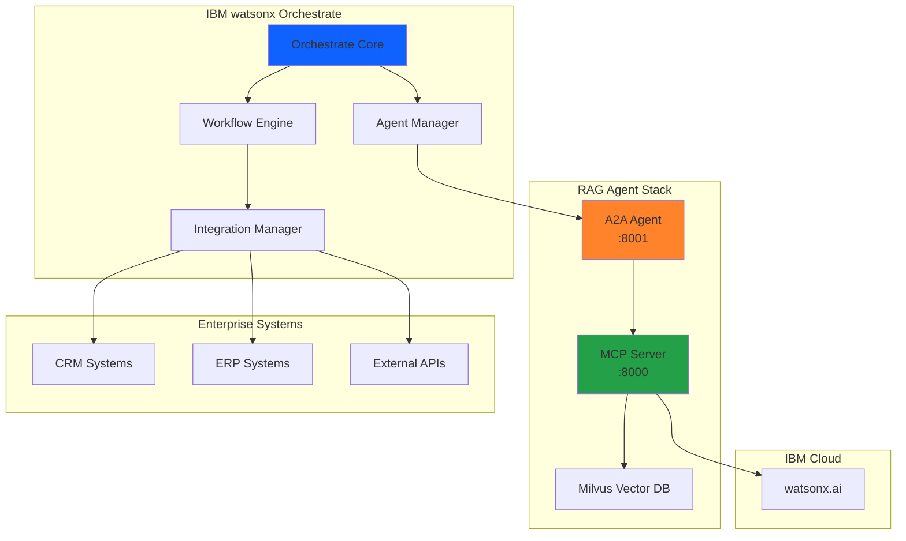
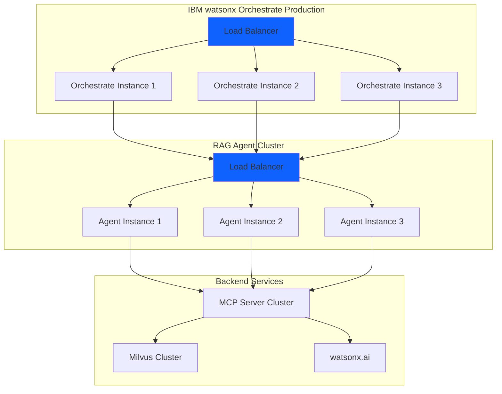

# IBM watsonx Orchestrate Deployment

Deploy and integrate the RAG agent with IBM watsonx Orchestrate for enterprise-grade orchestration, workflow management, and agent coordination.

## Overview

IBM watsonx Orchestrate provides a comprehensive platform for managing AI agents at scale. By integrating the RAG agent with Orchestrate, you gain:

- **Enterprise Orchestration**: Coordinate multiple agents and workflows
- **Agent Lifecycle Management**: Automated provisioning, scaling, and monitoring
- **Security & Compliance**: Enterprise-grade authentication, authorization, and audit logging
- **Integration Hub**: Connect to 100+ enterprise systems and services
- **Workflow Designer**: Visual tools for creating complex agent workflows

## Deployment Options

This guide covers two deployment scenarios:

1. **[Local Development](#local-development)**: Using Orchestrate Developer Edition for testing and development
2. **[Production Deployment](#production-deployment)**: Deploying to IBM watsonx Orchestrate SaaS or on-premises

## Architecture



## Local Development

This section covers setting up Orchestrate Developer Edition for local development and testing.

### Prerequisites

#### Required Software

1. **IBM watsonx Orchestrate Developer Edition**
   - Download from [IBM Developer Portal](https://developer.watson-orchestrate.ibm.com)
   - Requires entitlement key from IBM Marketplace

2. **Running RAG Agent**
   - Deploy locally using [Local Deployment Guide](local.md)
   - Agent must be accessible at `http://localhost:8001`

3. **Orchestrate CLI**
   - Installed with Orchestrate Developer Edition
   - Used for agent registration and management

#### Required Credentials

- **Watsonx.ai API Key**: From IBM Cloud
- **Watsonx.ai Space ID**: From your watsonx.ai workspace
- **Orchestrate Entitlement Key**: From IBM Marketplace (wxo/myibm)

### Installation

#### 1. Install Orchestrate Developer Edition

Follow the installation guide at [developer.watson-orchestrate.ibm.com](https://developer.watson-orchestrate.ibm.com):

```bash
# Download installer for your platform
# macOS, Linux, or Windows

# Follow platform-specific installation steps
```

#### 2. Configure Environment

Create environment configuration:

```bash
cd orchestrate
cp .env.example .env
```

Edit `.env` with your credentials:

```bash
# Watsonx.ai Configuration
WATSONX_APIKEY=your-api-key-here
WATSONX_SPACE_ID=your-space-id-here

# Orchestrate Configuration
WO_ENTITLEMENT_KEY=your-entitlement-key-here
WO_DEVELOPER_EDITION_SOURCE=myibm
```

#### 3. Start Orchestrate

```bash
cd orchestrate
bash scripts/startOrchestrate.sh
```

This starts Orchestrate with:
- Document processing enabled
- Environment variables loaded from `.env`
- Local development mode

### Agent Registration

#### 1. Verify RAG Agent is Running

```bash
# Check A2A agent health
curl http://localhost:8001/health

# Check agent capabilities

## Production Deployment

This section covers deploying the RAG agent to production IBM watsonx Orchestrate environments (SaaS or on-premises).

### Prerequisites

#### Infrastructure Requirements

1. **IBM watsonx Orchestrate Production Instance**
   - SaaS: Provisioned through IBM Cloud
   - On-premises: Installed on your infrastructure
   - Access credentials and tenant configuration

2. **Production RAG Agent Deployment**
   - Deploy to IBM Code Engine: [Code Engine Guide](ibm-code-engine.md)
   - Or deploy to your Kubernetes cluster
   - Agent must be accessible via HTTPS with valid SSL certificate

3. **Network Configuration**
   - Orchestrate must be able to reach agent endpoint
   - Configure firewall rules and network policies
   - Set up load balancing if needed

#### Required Credentials

- **Orchestrate API Key**: From your Orchestrate admin console
- **Orchestrate Tenant ID**: Your organization's tenant identifier
- **Watsonx.ai API Key**: Production API key from IBM Cloud
- **SSL Certificates**: For secure agent communication

### Architecture Considerations

#### High Availability



**Key Considerations:**

- **Multiple Instances**: Deploy 3+ agent instances for redundancy
- **Load Balancing**: Distribute traffic across instances
- **Health Checks**: Configure automatic failover
- **Auto-scaling**: Scale based on load metrics
- **Geographic Distribution**: Deploy across multiple regions for global availability

#### Security

**Authentication & Authorization:**

```yaml
security:
  authentication:
    type: oauth2
    provider: ibm-cloud
    tokenEndpoint: https://iam.cloud.ibm.com/identity/token
  
  authorization:
    type: rbac
    roles:
      - name: agent-user
        permissions: [invoke, query]
      - name: agent-admin
        permissions: [invoke, query, configure, monitor]
  
  tls:
    enabled: true
    minVersion: "1.3"
    certificateRef: agent-tls-cert
```

**Network Security:**

- Use private endpoints where possible
- Implement API gateway for rate limiting
- Enable mutual TLS (mTLS) for agent communication
- Configure IP whitelisting
- Use VPN or private connectivity for sensitive data

#### Monitoring & Observability

**Metrics Collection:**

```yaml
monitoring:
  prometheus:
    enabled: true
    endpoint: /metrics
    interval: 30s
  
  metrics:
    - request_rate
    - response_time_p95
    - error_rate
    - active_connections
    - queue_depth
  
  alerts:
    - name: high_error_rate
      condition: error_rate > 0.05
      severity: critical
      channels: [pagerduty, slack]
    
    - name: slow_response
      condition: response_time_p95 > 5000
      severity: warning
      channels: [slack]
```

**Logging:**

- Centralized logging (e.g., Splunk, ELK stack)
- Structured JSON logs
- Log retention policies
- Audit trail for compliance

### Production Configuration

#### Agent Configuration

Update `rag-agent-config.yml` for production:

```yaml
apiVersion: orchestrate.ibm.com/v1
kind: Agent

metadata:
  name: rag-knowledge-agent-prod
  environment: production
  version: 1.0.0

spec:
  agentId: rag-agent-prod
  agentName: RAG Knowledge Agent (Production)
  
  connection:
    type: https
    endpoint: https://rag-agent.your-domain.com
    protocol: a2a
    
    # TLS Configuration
    tls:
      enabled: true
      certificateRef: rag-agent-tls
      verifyClient: true
    
    # Health Check
    healthCheck:
      path: /health
      interval: 30s
      timeout: 10s
      retries: 3
      successThreshold: 2
  
  # Production Resource Limits
  resources:
    limits:
      cpu: "4000m"
      memory: "8Gi"
    requests:
      cpu: "2000m"
      memory: "4Gi"
  
  # Production Timeouts
  timeouts:
    request: 60s
    response: 120s
    idle: 600s
  
  # Enhanced Retry Policy
  retry:
    maxAttempts: 5
    backoff:
      type: exponential
      initialDelay: 2s
      maxDelay: 30s
      multiplier: 2
  
  # Production Security
  security:
    authentication:
      type: oauth2
      tokenEndpoint: https://iam.cloud.ibm.com/identity/token
    
    authorization:
      type: rbac
      roles: [agent-user, agent-admin]
    
    rateLimit:
      requestsPerMinute: 1000
      burstSize: 100
  
  # Enhanced Monitoring
  monitoring:
    metrics:
      enabled: true
      path: /metrics
      interval: 30s
    
    logging:
      level: INFO
      format: json
      destination: splunk
    
    tracing:
      enabled: true
      provider: jaeger
      samplingRate: 0.1
  
  # High Availability
  highAvailability:
    enabled: true
    minInstances: 3
    maxInstances: 10
    targetCPU: 70
    targetMemory: 80
```

#### Environment Configuration

Production `.env` file:

```bash
# IBM watsonx.ai Production
WATSONX_APIKEY=prod-api-key-here
WATSONX_SPACE_ID=prod-space-id-here
WATSONX_URL=https://us-south.ml.cloud.ibm.com

# IBM watsonx Orchestrate Production
WO_PRODUCTION_URL=https://orchestrate.your-domain.com
WO_API_KEY=prod-orchestrate-api-key
WO_TENANT_ID=your-tenant-id

# Agent Configuration
AGENT_ENDPOINT=https://rag-agent.your-domain.com
AGENT_TLS_CERT=/path/to/cert.pem
AGENT_TLS_KEY=/path/to/key.pem

# Monitoring
PROMETHEUS_ENDPOINT=https://prometheus.your-domain.com
SPLUNK_TOKEN=your-splunk-token
JAEGER_ENDPOINT=https://jaeger.your-domain.com
```

### Deployment Steps

#### 1. Deploy RAG Agent to Production

**Option A: IBM Code Engine**

```bash
# Deploy to Code Engine
cd RAG/deployment/ibm-code-engine
./deploy-all.sh production

# Verify deployment
ibmcloud ce application get rag-a2a-agent
```

**Option B: Kubernetes**

```bash
# Apply Kubernetes manifests
kubectl apply -f k8s/namespace.yaml
kubectl apply -f k8s/secrets.yaml
kubectl apply -f k8s/configmap.yaml
kubectl apply -f k8s/deployment.yaml
kubectl apply -f k8s/service.yaml
kubectl apply -f k8s/ingress.yaml

# Verify deployment
kubectl get pods -n rag-agent
kubectl get svc -n rag-agent
```

#### 2. Configure DNS and SSL

```bash
# Configure DNS record
# Point rag-agent.your-domain.com to load balancer IP

# Install SSL certificate
kubectl create secret tls rag-agent-tls \
  --cert=path/to/cert.pem \
  --key=path/to/key.pem \
  -n rag-agent
```

#### 3. Register with Orchestrate Production

```bash
# Set Orchestrate context
export ORCHESTRATE_URL=https://orchestrate.your-domain.com
export ORCHESTRATE_API_KEY=your-api-key
export ORCHESTRATE_TENANT_ID=your-tenant-id

# Activate virtual environment
source .venv/bin/activate

# Create and import production agent
orchestrate agents create \
  -n rag-agent-prod \
  -t "RAG Knowledge Agent (Production)" \
  -k external \
  --description "Production RAG agent with A2A protocol" \
  --api https://rag-agent.your-domain.com \
  --provider external_chat/A2A/0.3.0 \
  --auth-scheme BEARER_TOKEN \
  --auth-config '{"token": "your-api-token"}' \
  -o rag-agent-config-prod.yml

# Verify import
orchestrate agents list
```

**Note**: For production, configure proper authentication using `--auth-scheme` and `--auth-config`.

#### 4. Configure Monitoring

```bash
# Set up Prometheus scraping
kubectl apply -f monitoring/servicemonitor.yaml

# Configure alerts
kubectl apply -f monitoring/prometheusrule.yaml

# Set up dashboards
# Import Grafana dashboard from monitoring/grafana-dashboard.json
```

#### 5. Run Production Tests

```bash
# Health check
curl https://rag-agent.your-domain.com/health

# Smoke test
orchestrate agent invoke rag-knowledge-agent-prod \
  --input '{"query": "test query"}' \
  --environment production

# Load test
# Run load tests to verify performance under load
```

### Production Operations

#### Scaling

**Manual Scaling:**

```bash
# Scale agent instances
kubectl scale deployment rag-agent --replicas=5 -n rag-agent

# Update Orchestrate configuration
orchestrate agent update rag-knowledge-agent-prod \
  --min-instances 3 \
  --max-instances 10
```

**Auto-scaling:**

```yaml
apiVersion: autoscaling/v2
kind: HorizontalPodAutoscaler
metadata:
  name: rag-agent-hpa
spec:
  scaleTargetRef:
    apiVersion: apps/v1
    kind: Deployment
    name: rag-agent
  minReplicas: 3
  maxReplicas: 10
  metrics:
  - type: Resource
    resource:
      name: cpu
      target:
        type: Utilization
        averageUtilization: 70
  - type: Resource
    resource:
      name: memory
      target:
        type: Utilization
        averageUtilization: 80
```

#### Updates and Rollbacks

**Blue-Green Deployment:**

```bash
# Deploy new version (green)
kubectl apply -f k8s/deployment-v2.yaml

# Test new version
curl https://rag-agent-v2.your-domain.com/health

# Switch traffic to new version
kubectl patch service rag-agent -p '{"spec":{"selector":{"version":"v2"}}}'

# Rollback if needed
kubectl patch service rag-agent -p '{"spec":{"selector":{"version":"v1"}}}'
```

**Canary Deployment:**

```yaml
# Route 10% traffic to new version
apiVersion: networking.istio.io/v1beta1
kind: VirtualService
metadata:
  name: rag-agent
spec:
  hosts:
  - rag-agent.your-domain.com
  http:
  - match:
    - headers:
        canary:
          exact: "true"
    route:
    - destination:
        host: rag-agent-v2
  - route:
    - destination:
        host: rag-agent-v1
      weight: 90
    - destination:
        host: rag-agent-v2
      weight: 10
```

#### Disaster Recovery

**Backup Strategy:**

```bash
# Backup Milvus data
kubectl exec -it milvus-0 -- /bin/bash -c "milvus-backup create"

# Backup configuration
kubectl get configmap rag-agent-config -o yaml > backup/config.yaml
kubectl get secret rag-agent-secrets -o yaml > backup/secrets.yaml

# Backup Orchestrate configuration
orchestrate agent export rag-knowledge-agent-prod > backup/agent-config.yaml
```

**Recovery Procedures:**

1. **Agent Failure**: Auto-healing via Kubernetes
2. **Data Loss**: Restore from Milvus backup
3. **Region Failure**: Failover to secondary region
4. **Complete Disaster**: Restore from backups in DR site

### Production Best Practices

#### Performance Optimization

1. **Connection Pooling**: Reuse connections to backend services
2. **Caching**: Cache frequently accessed data
3. **Async Processing**: Use async operations for long-running tasks
4. **Resource Tuning**: Optimize CPU and memory allocation

#### Security Hardening

1. **Principle of Least Privilege**: Minimal permissions for service accounts
2. **Secret Management**: Use vault for sensitive data
3. **Network Policies**: Restrict traffic between services
4. **Regular Updates**: Keep dependencies and base images updated
5. **Security Scanning**: Regular vulnerability scans

#### Compliance

1. **Audit Logging**: Comprehensive audit trails
2. **Data Residency**: Ensure data stays in required regions
3. **Encryption**: Encrypt data at rest and in transit
4. **Access Controls**: Role-based access with MFA
5. **Compliance Reports**: Regular compliance audits

### Troubleshooting Production Issues

#### High Latency

**Diagnosis:**

```bash
# Check agent metrics
curl https://rag-agent.your-domain.com/metrics | grep response_time

# Check backend services
curl https://mcp-server.your-domain.com/health
```

**Solutions:**

- Scale up agent instances
- Optimize database queries
- Add caching layer
- Review network latency

#### High Error Rate

**Diagnosis:**

```bash
# Check error logs
kubectl logs -l app=rag-agent --tail=100 | grep ERROR

# Check Orchestrate logs
orchestrate agent logs rag-knowledge-agent-prod --level ERROR
```

**Solutions:**

- Review error patterns
- Check backend service health
- Verify configuration
- Roll back if recent deployment

#### Resource Exhaustion

**Diagnosis:**

```bash
# Check resource usage
kubectl top pods -n rag-agent

# Check metrics
curl https://rag-agent.your-domain.com/metrics | grep memory
```

**Solutions:**

- Increase resource limits
- Scale horizontally
- Optimize memory usage
- Check for memory leaks

### Support and Resources

#### IBM Support

- **Technical Support**: [IBM Support Portal](https://www.ibm.com/support)
- **Orchestrate Support**: [watsonx Orchestrate Support](https://www.ibm.com/support/pages/ibm-watsonx-orchestrate)
- **Emergency Hotline**: Available 24/7 for production issues

#### Documentation

- [IBM watsonx Orchestrate Production Guide](https://developer.watson-orchestrate.ibm.com/docs/production)
- [Security Best Practices](https://developer.watson-orchestrate.ibm.com/docs/security)
- [Performance Tuning Guide](https://developer.watson-orchestrate.ibm.com/docs/performance)

#### Community

- [IBM Developer Community](https://community.ibm.com)
- [Orchestrate Forums](https://developer.watson-orchestrate.ibm.com/community)
- [Stack Overflow](https://stackoverflow.com/questions/tagged/ibm-watsonx-orchestrate)

curl http://localhost:8001/capabilities
```

Expected response:
```json
{
  "agent_id": "rag-agent",
  "agent_name": "RAG Knowledge Agent",
  "capabilities": ["rag_query", "knowledge_search", "document_qa"],
  "version": "0.1.0"
}
```

#### 2. Create and Import Shakespeare Agent into Orchestrate

```bash
# Activate the orchestrate virtual environment
cd orchestrate
source .venv/bin/activate

# Create and import the Shakespeare knowledge agent
orchestrate agents create \
  -n shakespeare-rag-agent \
  -t "Shakespeare Knowledge Agent" \
  -k external \
  --description "RAG agent with complete works of Shakespeare. Use for questions about Shakespeare's plays, sonnets, characters, quotes, and literary analysis." \
  --api http://127.0.0.1:8001 \
  --provider external_chat/A2A/0.3.0 \
  -o rag-agent-config.yml
```

**Important**: Use `127.0.0.1` instead of `localhost` to avoid IPv6 connection issues.

This command:
- Creates an external agent with A2A protocol support
- Imports it into Orchestrate with Shakespeare-specific knowledge
- Saves the configuration to `rag-agent-config.yml` for future use

**Configuration Parameters:**
- `kind: external` - External agent type
- `name: shakespeare-rag-agent` - Descriptive name indicating Shakespeare content
- `title: Shakespeare Knowledge Agent` - Display name in Orchestrate
- `description` - Clearly indicates the knowledge base contains Shakespeare's works
- `provider: external_chat/A2A/0.3.0` - A2A protocol version 0.3.0
- `api_url: http://127.0.0.1:8001` - Agent endpoint (use 127.0.0.1, not localhost)
- `auth_scheme: NONE` - No authentication (update for production)

**Knowledge Base**: The agent has access to the complete works of William Shakespeare, making it suitable for:
- Literary analysis and research
- Character and plot questions
- Quote identification and context
- Thematic exploration
- Educational applications

#### 3. Verify Import

```bash
# List all imported agents
orchestrate agents list

# Test agent health
curl http://localhost:8001/health
```

## Configuration

### Agent Configuration File

The `rag-agent-config.yml` file contains comprehensive configuration:

```yaml
apiVersion: orchestrate.ibm.com/v1
kind: Agent

metadata:
  name: rag-knowledge-agent
  description: Agent for querying RAG knowledge base
  version: 0.1.0

spec:
  agentId: rag-agent
  agentName: RAG Knowledge Agent
  
  connection:
    type: http
    endpoint: http://localhost:8001
    protocol: a2a
    
  capabilities:
    - name: rag_query
      description: Query the RAG knowledge base
    - name: knowledge_search
      description: Search for relevant information
    - name: document_qa
      description: Answer questions from documents
```

### Customization Options

#### Endpoint Configuration

For remote deployments, update the endpoint:

```yaml
connection:
  endpoint: https://your-rag-agent.example.com
```

#### Resource Limits

Adjust resource constraints:

```yaml
resources:
  limits:
    cpu: "2000m"
    memory: "4Gi"
  requests:
    cpu: "1000m"
    memory: "2Gi"
```

#### Timeout Configuration

Modify timeout values:

```yaml
timeouts:
  request: 60s
  response: 120s
  idle: 600s
```

#### Retry Policy

Configure retry behavior:

```yaml
retry:
  maxAttempts: 5
  backoff:
    type: exponential
    initialDelay: 2s
    maxDelay: 30s
```

## Usage

### Invoke Agent from Orchestrate

```bash
# Direct invocation
orchestrate agent invoke rag-knowledge-agent \
  --input '{"query": "What is the A2A protocol?"}'

# Via workflow
orchestrate workflow run knowledge-query \
  --param query="Explain RAG architecture"
```

### Create Workflows

Create a workflow that uses the RAG agent:

```yaml
workflow:
  name: knowledge-assistant
  description: Answer questions using RAG
  
  steps:
    - name: query-knowledge
      agent: rag-knowledge-agent
      capability: rag_query
      input:
        query: ${workflow.input.question}
    
    - name: format-response
      action: format-text
      input:
        template: "Answer: ${query-knowledge.response}"
```

### Monitor Agent Activity

```bash
# View agent logs
orchestrate agent logs rag-knowledge-agent

# Get agent metrics
orchestrate agent metrics rag-knowledge-agent

# Check agent health
orchestrate agent health rag-knowledge-agent
```

## Integration Patterns

### 1. Knowledge Query Workflow

Integrate RAG agent into a customer support workflow:

```yaml
workflow:
  name: customer-support
  trigger: incoming-ticket
  
  steps:
    - name: classify-ticket
      agent: classification-agent
    
    - name: search-knowledge
      agent: rag-knowledge-agent
      capability: knowledge_search
      input:
        query: ${classify-ticket.summary}
    
    - name: generate-response
      agent: response-agent
      input:
        context: ${search-knowledge.results}
```

### 2. Multi-Agent Collaboration

Coordinate multiple agents:

```yaml
workflow:
  name: research-assistant
  
  steps:
    - name: gather-information
      parallel:
        - agent: rag-knowledge-agent
          capability: document_qa
        - agent: web-search-agent
          capability: search
    
    - name: synthesize-results
      agent: synthesis-agent
      input:
        sources:
          - ${gather-information.rag-knowledge-agent}
          - ${gather-information.web-search-agent}
```

### 3. Event-Driven Processing

React to events with RAG agent:

```yaml
event-handler:
  name: document-updated
  trigger: document.updated
  
  actions:
    - agent: rag-knowledge-agent
      capability: rag_index
      input:
        document_id: ${event.document_id}
```

## Monitoring and Observability

### Metrics

Orchestrate provides comprehensive metrics:

- **Request Rate**: Requests per minute
- **Response Time**: P50, P95, P99 latencies
- **Success Rate**: Percentage of successful requests
- **Error Rate**: Percentage of failed requests
- **Resource Usage**: CPU and memory utilization

### Logging

Access agent logs:

```bash
# Real-time logs
orchestrate agent logs -f rag-knowledge-agent

# Filter by level
orchestrate agent logs --level ERROR rag-knowledge-agent

# Export logs
orchestrate agent logs --export logs.json rag-knowledge-agent
```

### Alerting

Configure alerts for critical events:

```yaml
alert:
  name: high-error-rate
  condition: error_rate > 0.05
  agent: rag-knowledge-agent
  notification:
    - type: email
      recipients: [admin@example.com]
    - type: slack
      channel: #alerts
```

## Troubleshooting

### Agent Not Responding

**Issue**: Orchestrate cannot reach the agent

**Solution**:
```bash
# Check agent health
curl http://localhost:8001/health

# Verify network connectivity
orchestrate agent ping rag-knowledge-agent

# Check agent logs
orchestrate agent logs rag-knowledge-agent
```

### Registration Failed

**Issue**: Agent registration fails

**Solution**:
```bash
# Verify Orchestrate is running
orchestrate server status

# Review import logs
orchestrate agents import -f rag-agent-config.yml
```

### Timeout Errors

**Issue**: Agent requests timing out

**Solution**:
1. Increase timeout values in configuration
2. Check agent performance metrics
3. Scale agent resources if needed

```yaml
timeouts:
  request: 120s  # Increase from 30s
  response: 180s  # Increase from 60s
```

### High Error Rate

**Issue**: Agent returning errors frequently

**Solution**:
```bash
# Check agent health
curl http://localhost:8001/health

# Review error logs
orchestrate agent logs --level ERROR rag-knowledge-agent

# Check dependencies (MCP server, Milvus)
curl http://localhost:8000/health
```

## Best Practices

### 1. Configuration Management

- Store configurations in version control
- Use environment-specific configurations
- Document all customizations
- Test configuration changes in development first

### 2. Security

- Rotate API keys regularly
- Use least-privilege access
- Enable audit logging
- Implement rate limiting

### 3. Performance

- Monitor response times
- Set appropriate resource limits
- Use caching where possible
- Scale based on metrics

### 4. Reliability

- Configure health checks
- Implement retry policies
- Set up alerting
- Plan for failover

## Resources

### Documentation

- [IBM watsonx Orchestrate Documentation](https://developer.watson-orchestrate.ibm.com)
- [Orchestrate Architecture](../architecture/orchestrate.md)
- [A2A Protocol](../protocols/a2a.md)
- [RAG Agent Overview](../rag/overview.md)

### Configuration

- [Agent Configuration File](../../orchestrate/rag-agent-config.yml)
- [Environment Variables](../../orchestrate/.env.example)
- [Start Script](../../orchestrate/scripts/startOrchestrate.sh)

### Support

- [IBM Developer Community](https://community.ibm.com)
- [Orchestrate Forums](https://developer.watson-orchestrate.ibm.com/community)
- [GitHub Issues](https://github.com/yourusername/yourrepo/issues)

## Next Steps

- [Create Custom Workflows](https://developer.watson-orchestrate.ibm.com/docs/workflows)
- [Integrate with Enterprise Systems](https://developer.watson-orchestrate.ibm.com/docs/integrations)
- [Deploy to Production](ibm-code-engine.md)
- [Monitor and Optimize](https://developer.watson-orchestrate.ibm.com/docs/monitoring)

## Made with Bob