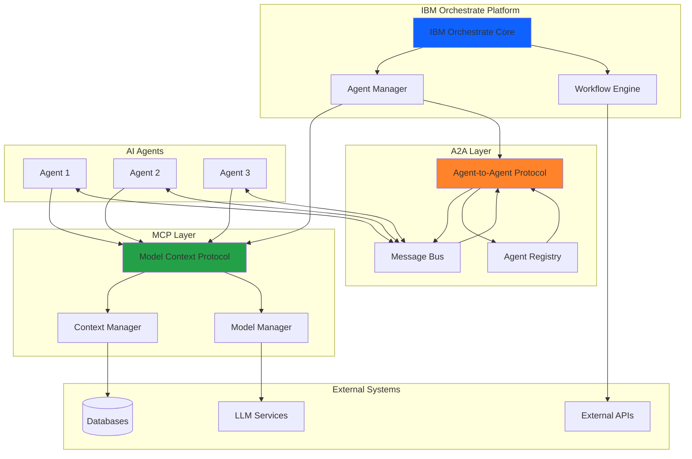

# AI Agents Project

Welcome to the AI Agents Project documentation. This project leverages **IBM Orchestrate** as the core agent platform to build intelligent, autonomous agents that can communicate and collaborate effectively.

## What are AI Agents?

AI Agents are autonomous software entities that can perceive their environment, make decisions, and take actions to achieve specific goals. They combine artificial intelligence capabilities with the ability to interact with various systems, tools, and other agents.

### Key Characteristics

- **Autonomy**: Agents operate independently without constant human intervention
- **Reactivity**: They respond to changes in their environment in real-time
- **Proactivity**: Agents take initiative to achieve their goals
- **Social Ability**: They can communicate and collaborate with other agents and humans

## Architecture Overview

Our AI agent platform is built on **IBM Orchestrate**, which provides a robust foundation for agent orchestration, workflow management, and integration capabilities.

### Protocol Integration: MCP and A2A

The following diagram illustrates the relationship between the Model Context Protocol (MCP) and Agent-to-Agent (A2A) communication within the IBM Orchestrate platform:



### Protocol Descriptions

#### Model Context Protocol (MCP)

MCP provides a standardized way for agents to interact with AI models and manage context:

- **Context Management**: Maintains conversation history and relevant information
- **Model Abstraction**: Provides a unified interface to various LLM providers
- **State Persistence**: Ensures context is preserved across interactions

#### Agent-to-Agent Protocol (A2A)

A2A enables seamless communication and collaboration between agents:

- **Message Routing**: Efficiently routes messages between agents
- **Agent Discovery**: Allows agents to find and connect with other agents
- **Coordination**: Facilitates collaborative task execution

## Featured Implementation: A2A RAG Agent

We've built a production-ready **Retrieval-Augmented Generation (RAG) agent** that demonstrates the power of combining A2A protocol with modern AI capabilities:

### Key Features

- **A2A Protocol Integration**: Full implementation of Agent-to-Agent communication
- **MCP Server**: RESTful API with 9 endpoints for RAG operations
- **Watsonx.ai Integration**: IBM's AI platform for embeddings and LLM services
- **Milvus Vector Store**: High-performance semantic search with COSINE similarity
- **LangGraph Workflows**: State machine orchestration for complex agent behaviors
- **Production-Ready**: 100% test coverage (34/34 tests passing)

### Quick Start

```bash
cd RAG
./scripts/start_services.sh
curl -X POST http://localhost:8000/tools/rag_query \
  -H "Content-Type: application/json" \
  -d '{"query": "What is the A2A protocol?"}'
```

[Get Started with RAG Agent →](rag/quickstart.md)

## Explore the Documentation

### RAG Agent Documentation

- [Overview](rag/overview.md) - Architecture and components
- [Quick Start](rag/quickstart.md) - Installation and setup
- [API Reference](rag/api-reference.md) - Complete API documentation
- [Configuration](rag/configuration.md) - Configuration and tuning
- [Testing](rag/testing.md) - Testing guide and results
- [Troubleshooting](rag/troubleshooting.md) - Common issues and solutions

### Platform Documentation

1. [Architecture Overview](architecture/overview.md) - System architecture
2. [IBM Orchestrate](architecture/orchestrate.md) - Orchestration platform
3. [MCP Protocol](protocols/mcp.md) - Model Context Protocol
4. [A2A Communication](protocols/a2a.md) - Agent-to-Agent Protocol

## Project Status

| Component | Status | Tests | Documentation |
|-----------|--------|-------|---------------|
| A2A RAG Agent | ✅ Complete | 34/34 passing | ✅ Complete |
| MCP Server | ✅ Complete | 18/18 passing | ✅ Complete |
| Watsonx.ai Integration | ✅ Complete | Tested | ✅ Complete |
| Milvus Vector Store | ✅ Complete | Tested | ✅ Complete |

## Benefits

- **Scalability**: Build agents that can handle increasing workloads
- **Flexibility**: Integrate with various AI models and external systems
- **Reliability**: Leverage IBM Orchestrate's enterprise-grade infrastructure
- **Collaboration**: Enable agents to work together on complex tasks
- **Production-Ready**: Comprehensive testing, monitoring, and deployment automation

## Built With

This project was created using **[IBM Bob](https://github.com/ibm/bob)** - an AI-powered development assistant that accelerates development with:

- **Intelligent Code Generation**: Production-ready code following best practices
- **Comprehensive Documentation**: Automated documentation generation with MkDocs
- **Testing & Quality**: Built-in testing frameworks and quality assurance
- **Deployment Automation**: Container builds and deployment scripts
- **Architecture Design**: Well-structured, maintainable codebases

---
