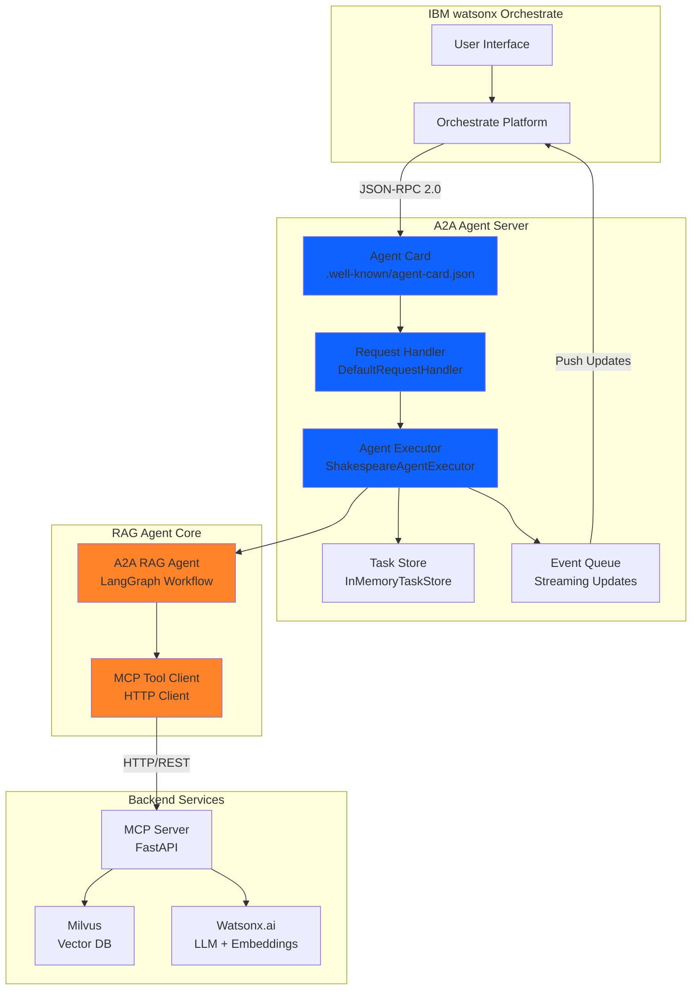

# Agent-to-Agent Protocol (A2A)

## Overview

The **Agent-to-Agent Protocol (A2A)** enables seamless communication and collaboration between autonomous agents within the IBM watsonx Orchestrate platform. This implementation uses the official **A2A 0.3.0 specification** with the `a2a-server` framework to provide standards-compliant agent integration.

## Purpose

A2A solves critical challenges in multi-agent systems:

- **Standardized Communication**: JSON-RPC 2.0 based messaging protocol
- **Agent Discovery**: Agents expose capabilities via agent cards
- **Task Management**: Structured task lifecycle with state tracking
- **Streaming Updates**: Real-time progress updates during task execution
- **IBM Orchestrate Integration**: Native integration with watsonx Orchestrate

## Architecture



## Core Components

### 1. Agent Card

The agent card describes the agent's capabilities and is served at `/.well-known/agent-card.json`:

```python
from a2a.types import AgentCard, AgentCapabilities, AgentSkill

def create_agent_card(settings: Settings, host: str, port: int) -> AgentCard:
    """Create the agent card describing agent capabilities."""
    capabilities = AgentCapabilities(
        streaming=False,
        push_notifications=False,
    )
    
    skill = AgentSkill(
        id='shakespeare_knowledge',
        name='Shakespeare Knowledge Base',
        description='Search and answer questions about Shakespeare\'s complete works',
        tags=['shakespeare', 'literature', 'plays', 'sonnets'],
        examples=[
            'Who is Hamlet?',
            'What are the main characters in Othello?',
            'Tell me about Romeo and Juliet',
        ],
    )
    
    agent_card = AgentCard(
        name=settings.a2a_agent_name,
        description=settings.a2a_agent_description,
        url=f'http://{host}:{port}/',
        version='1.0.0',
        default_input_modes=['text', 'text/plain'],
        default_output_modes=['text', 'text/plain'],
        capabilities=capabilities,
        skills=[skill],
    )
    
    return agent_card
```

### 2. Agent Executor

The executor handles incoming requests and manages task execution:

```python
from a2a.server.agent_execution import AgentExecutor, RequestContext
from a2a.server.events import EventQueue
from a2a.server.tasks import TaskUpdater
from a2a.types import TaskState

class ShakespeareAgentExecutor(AgentExecutor):
    """Shakespeare RAG Agent Executor for A2A Protocol."""
    
    def __init__(self):
        """Initialize the executor with the RAG agent."""
        settings = Settings()
        self.agent = A2ARAGAgent(settings)
    
    async def execute(
        self,
        context: RequestContext,
        event_queue: EventQueue,
    ) -> None:
        """Execute a query against the Shakespeare knowledge base."""
        # Extract query from user input
        query = context.get_user_input()
        
        # Get or create task
        task = context.current_task
        if not task:
            task = new_task(context.message)
            await event_queue.enqueue_event(task)
        
        updater = TaskUpdater(event_queue, task.id, task.context_id)
        
        # Update status to working
        await updater.update_status(
            TaskState.working,
            new_agent_text_message(
                "Searching Shakespeare's works...",
                task.context_id,
                task.id,
            ),
        )
        
        # Process query through RAG agent
        result = await self.agent.process_query(query)
        
        # Add artifact with the answer
        await updater.add_artifact(
            [Part(root=TextPart(text=result['response']))],
            name="shakespeare_answer",
        )
        
        # Mark task as complete
        await updater.complete()
```

### 3. LangGraph Workflow

The RAG agent uses LangGraph for workflow orchestration:

```python
from langgraph.graph import StateGraph, END
from agent.state import AgentState

class A2ARAGAgent:
    """A2A-based RAG agent using LangGraph for orchestration."""
    
    def _build_graph(self) -> StateGraph:
        """Build the LangGraph workflow."""
        workflow = StateGraph(AgentState)
        
        # Add nodes
        workflow.add_node("process_input", self._process_input)
        workflow.add_node("retrieve_context", self._retrieve_context)
        workflow.add_node("generate_response", self._generate_response)
        workflow.add_node("handle_error", self._handle_error)
        
        # Set entry point
        workflow.set_entry_point("process_input")
        
        # Add conditional edges
        workflow.add_conditional_edges(
            "process_input",
            self._route_after_input,
            {"retrieve": "retrieve_context", "error": "handle_error"},
        )
        
        workflow.add_conditional_edges(
            "retrieve_context",
            self._route_after_retrieval,
            {"generate": "generate_response", "error": "handle_error"},
        )
        
        workflow.add_edge("generate_response", END)
        workflow.add_edge("handle_error", END)
        
        return workflow.compile()
```

### 4. MCP Tool Client

The agent communicates with the MCP server for RAG operations:

```python
import httpx
from config.settings import Settings

class MCPToolClient:
    """Client for calling MCP RAG tools."""
    
    def __init__(self, settings: Settings):
        """Initialize MCP tool client."""
        self.settings = settings
        self.base_url = settings.get_mcp_server_url()
        self.client = httpx.AsyncClient(
            timeout=30.0,
            http2=False,
            follow_redirects=True,
        )
    
    async def rag_query(
        self,
        query: str,
        top_k: Optional[int] = None,
        include_sources: bool = True,
    ) -> Dict[str, Any]:
        """Call the rag_query MCP tool."""
        response = await self.client.post(
            f"{self.base_url}/tools/rag_query",
            json={
                "query": query,
                "top_k": top_k,
                "include_sources": include_sources,
            },
        )
        response.raise_for_status()
        return response.json()
```

## Protocol Specification (A2A 0.3.0)

### JSON-RPC 2.0 Request Format

All A2A communication uses JSON-RPC 2.0 over HTTP POST:

```json
{
  "jsonrpc": "2.0",
  "id": "req-123",
  "method": "agent/execute",
  "params": {
    "message": {
      "role": "user",
      "parts": [
        {
          "text": "Who is Hamlet?"
        }
      ]
    },
    "context_id": "ctx-456"
  }
}
```

### Agent Card Format

Served at `/.well-known/agent-card.json`:

```json
{
  "name": "Shakespeare Knowledge Agent",
  "description": "RAG agent with complete works of Shakespeare",
  "url": "http://localhost:8001/",
  "version": "1.0.0",
  "default_input_modes": ["text", "text/plain"],
  "default_output_modes": ["text", "text/plain"],
  "capabilities": {
    "streaming": false,
    "push_notifications": false
  },
  "skills": [
    {
      "id": "shakespeare_knowledge",
      "name": "Shakespeare Knowledge Base",
      "description": "Search and answer questions about Shakespeare's complete works",
      "tags": ["shakespeare", "literature", "plays", "sonnets"],
      "examples": [
        "Who is Hamlet?",
        "What are the main characters in Othello?"
      ]
    }
  ]
}
```

### Task State Updates

The agent sends task state updates via the event queue:

```json
{
  "type": "task",
  "task": {
    "id": "task-789",
    "context_id": "ctx-456",
    "state": "working",
    "messages": [
      {
        "role": "agent",
        "parts": [
          {
            "text": "Searching Shakespeare's works for relevant information..."
          }
        ]
      }
    ]
  }
}
```

### Task Completion with Artifacts

```json
{
  "type": "task",
  "task": {
    "id": "task-789",
    "context_id": "ctx-456",
    "state": "completed",
    "artifacts": [
      {
        "name": "shakespeare_answer",
        "parts": [
          {
            "text": "Hamlet is the Prince of Denmark and the protagonist..."
          }
        ]
      }
    ]
  }
}
```

## Communication Patterns

### 1. Request-Response

Synchronous communication for immediate responses:

```python
# Send request and wait for response
response = a2a.request(
    to='translation-agent',
    action='translate',
    payload={
        'text': 'Hello, world!',
        'target_lang': 'es'
    },
    timeout=5000
)

print(response.payload['translated_text'])
```

### 2. Fire-and-Forget

Asynchronous communication without waiting for response:

```python
# Send message without waiting
a2a.send(
    to='logging-agent',
    action='log_event',
    payload={
        'event': 'user_login',
        'user_id': 'user-123'
    }
)
```

### 3. Publish-Subscribe

Event-driven communication:

```python
# Subscribe to events
a2a.subscribe_event(
    event_type='order.created',
    handler=handle_new_order
)

# Publish event
a2a.publish_event(
    event_type='order.created',
    payload={
        'order_id': 'ord-456',
        'customer_id': 'cust-789',
        'total': 99.99
    }
)
```

### 4. Request-Reply with Callback

Asynchronous request with callback:

```python
# Send request with callback
a2a.request_async(
    to='data-processing-agent',
    action='process_large_dataset',
    payload={'dataset': 'large-data.csv'},
    callback=handle_processing_complete
)

def handle_processing_complete(response):
    print(f"Processing complete: {response.payload}")
```

### 5. Workflow Coordination

Multi-agent workflow coordination:

```python
# Define workflow
workflow = a2a.create_workflow(
    name='order-fulfillment',
    steps=[
        {
            'agent': 'inventory-agent',
            'action': 'check_availability',
            'input': '${order.items}'
        },
        {
            'agent': 'payment-agent',
            'action': 'process_payment',
            'input': '${order.payment_info}',
            'depends_on': ['check_availability']
        },
        {
            'agent': 'shipping-agent',
            'action': 'create_shipment',
            'input': '${order.shipping_info}',
            'depends_on': ['process_payment']
        }
    ]
)

# Execute workflow
result = a2a.execute_workflow(
    workflow='order-fulfillment',
    input={'order': order_data}
)
```

## Resources

- [A2A 0.3.0 Specification](https://github.com/IBM/agent-to-agent-protocol)
- [a2a-server Framework](https://pypi.org/project/a2a-server/)
- [RAG Agent Implementation](../../RAG/agent/a2a_agent.py)
- [Agent Executor](../../RAG/agent/agent_executor.py)
- [MCP Protocol](mcp.md)
- [Orchestrate Integration](../architecture/orchestrate.md)
- [RAG Overview](../rag/overview.md)