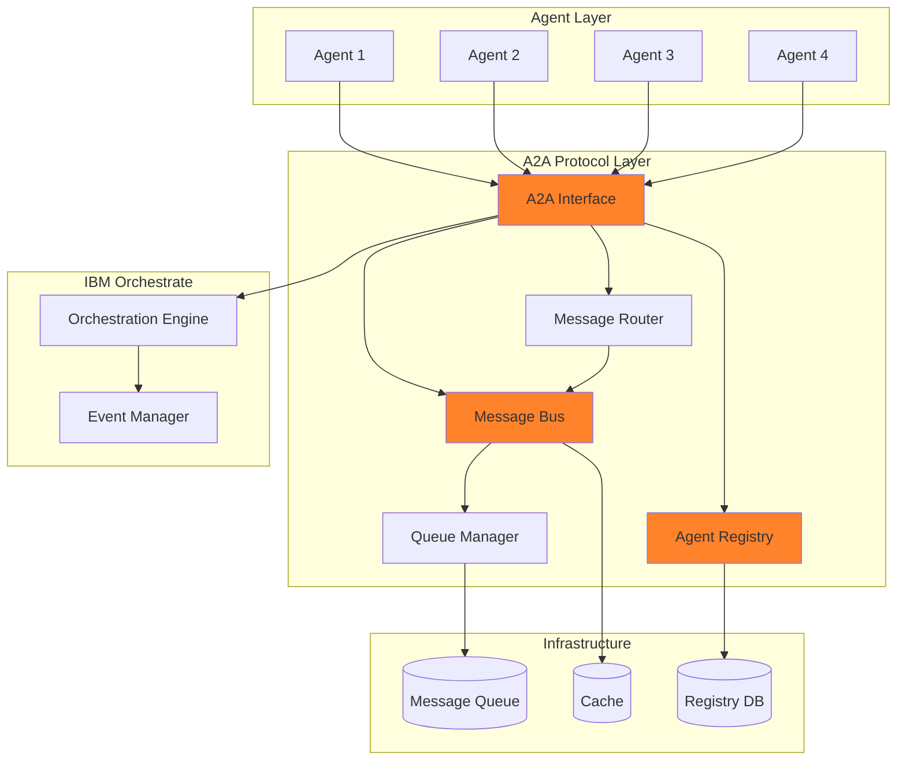

# Agent-to-Agent Protocol (A2A)

## Overview

The **Agent-to-Agent Protocol (A2A)** enables seamless communication and collaboration between autonomous agents within the IBM Orchestrate platform. A2A provides a standardized messaging framework that allows agents to discover each other, exchange information, coordinate tasks, and work together to accomplish complex goals.

## Purpose

A2A solves critical challenges in multi-agent systems:

- **Agent Discovery**: Find and connect with other agents dynamically
- **Message Routing**: Efficiently route messages between agents
- **Coordination**: Synchronize activities across multiple agents
- **Reliability**: Ensure message delivery with acknowledgments and retries
- **Security**: Authenticate and authorize inter-agent communication

## Architecture



## Core Components

### 1. Agent Registry

Maintains a directory of all active agents:

```python
from a2a import A2AClient

# Initialize A2A client
a2a = A2AClient(
    agent_id='customer-service-agent',
    orchestrate_endpoint=os.getenv('ORCHESTRATE_ENDPOINT')
)

# Register agent
a2a.register(
    capabilities=['chat', 'email', 'ticket-management'],
    metadata={
        'version': '1.0.0',
        'max_concurrent_tasks': 10,
        'specialization': 'customer-support'
    }
)

# Discover agents
agents = a2a.discover(
    capability='data-analysis',
    filters={'specialization': 'financial'}
)
```

### 2. Message Bus

Handles message routing and delivery:

```python
# Send direct message
a2a.send_message(
    to='data-analysis-agent',
    message={
        'type': 'request',
        'action': 'analyze_data',
        'payload': {
            'dataset': 'sales-2026-q1.csv',
            'analysis_type': 'trend'
        }
    },
    priority='high',
    timeout=30000
)

# Broadcast message
a2a.broadcast(
    message={
        'type': 'notification',
        'event': 'system_maintenance',
        'scheduled_at': '2026-01-20T00:00:00Z'
    },
    filters={'capability': 'monitoring'}
)
```

### 3. Message Router

Intelligently routes messages based on agent capabilities:

```python
# Route to best available agent
response = a2a.route_request(
    capability='translation',
    message={
        'text': 'Hello, world!',
        'source_lang': 'en',
        'target_lang': 'fr'
    },
    routing_strategy='least-loaded'
)
```

### 4. Queue Manager

Manages message queues for reliable delivery:

```python
# Subscribe to queue
a2a.subscribe(
    queue='customer-inquiries',
    handler=handle_inquiry,
    max_concurrent=5
)

# Publish to queue
a2a.publish(
    queue='customer-inquiries',
    message={
        'inquiry_id': 'inq-12345',
        'customer_id': 'cust-67890',
        'message': 'I need help with my order'
    }
)
```

## Protocol Specification

### Message Format

```json
{
  "version": "1.0",
  "message_id": "msg-abc123",
  "timestamp": "2026-01-15T11:42:00Z",
  "from": {
    "agent_id": "customer-service-agent",
    "instance_id": "inst-001"
  },
  "to": {
    "agent_id": "data-analysis-agent",
    "instance_id": "inst-002"
  },
  "type": "request",
  "action": "analyze_data",
  "payload": {
    "dataset": "sales-2026-q1.csv",
    "analysis_type": "trend"
  },
  "metadata": {
    "priority": "high",
    "timeout": 30000,
    "correlation_id": "corr-xyz789",
    "reply_to": "customer-service-agent"
  }
}
```

### Response Format

```json
{
  "version": "1.0",
  "message_id": "msg-def456",
  "timestamp": "2026-01-15T11:42:05Z",
  "from": {
    "agent_id": "data-analysis-agent",
    "instance_id": "inst-002"
  },
  "to": {
    "agent_id": "customer-service-agent",
    "instance_id": "inst-001"
  },
  "type": "response",
  "status": "success",
  "payload": {
    "analysis_results": {
      "trend": "upward",
      "growth_rate": 15.3,
      "confidence": 0.92
    }
  },
  "metadata": {
    "correlation_id": "corr-xyz789",
    "processing_time_ms": 4850
  }
}
```

### Error Format

```json
{
  "version": "1.0",
  "message_id": "msg-ghi789",
  "timestamp": "2026-01-15T11:42:05Z",
  "from": {
    "agent_id": "data-analysis-agent",
    "instance_id": "inst-002"
  },
  "to": {
    "agent_id": "customer-service-agent",
    "instance_id": "inst-001"
  },
  "type": "error",
  "error": {
    "code": "INVALID_DATASET",
    "message": "Dataset not found or inaccessible",
    "details": {
      "dataset": "sales-2026-q1.csv",
      "reason": "file_not_found"
    }
  },
  "metadata": {
    "correlation_id": "corr-xyz789"
  }
}
```

## Communication Patterns

### 1. Request-Response

Synchronous communication for immediate responses:

```python
# Send request and wait for response
response = a2a.request(
    to='translation-agent',
    action='translate',
    payload={
        'text': 'Hello, world!',
        'target_lang': 'es'
    },
    timeout=5000
)

print(response.payload['translated_text'])
```

### 2. Fire-and-Forget

Asynchronous communication without waiting for response:

```python
# Send message without waiting
a2a.send(
    to='logging-agent',
    action='log_event',
    payload={
        'event': 'user_login',
        'user_id': 'user-123'
    }
)
```

### 3. Publish-Subscribe

Event-driven communication:

```python
# Subscribe to events
a2a.subscribe_event(
    event_type='order.created',
    handler=handle_new_order
)

# Publish event
a2a.publish_event(
    event_type='order.created',
    payload={
        'order_id': 'ord-456',
        'customer_id': 'cust-789',
        'total': 99.99
    }
)
```

### 4. Request-Reply with Callback

Asynchronous request with callback:

```python
# Send request with callback
a2a.request_async(
    to='data-processing-agent',
    action='process_large_dataset',
    payload={'dataset': 'large-data.csv'},
    callback=handle_processing_complete
)

def handle_processing_complete(response):
    print(f"Processing complete: {response.payload}")
```

### 5. Workflow Coordination

Multi-agent workflow coordination:

```python
# Define workflow
workflow = a2a.create_workflow(
    name='order-fulfillment',
    steps=[
        {
            'agent': 'inventory-agent',
            'action': 'check_availability',
            'input': '${order.items}'
        },
        {
            'agent': 'payment-agent',
            'action': 'process_payment',
            'input': '${order.payment_info}',
            'depends_on': ['check_availability']
        },
        {
            'agent': 'shipping-agent',
            'action': 'create_shipment',
            'input': '${order.shipping_info}',
            'depends_on': ['process_payment']
        }
    ]
)

# Execute workflow
result = a2a.execute_workflow(
    workflow='order-fulfillment',
    input={'order': order_data}
)
```

## Features

### 1. Agent Discovery

Dynamic agent discovery based on capabilities:

```python
# Find agents by capability
agents = a2a.discover(
    capability='image-processing',
    filters={
        'available': True,
        'load': {'$lt': 0.8}
    }
)

# Get agent details
agent_info = a2a.get_agent_info('image-processing-agent')
print(f"Capabilities: {agent_info.capabilities}")
print(f"Status: {agent_info.status}")
print(f"Load: {agent_info.current_load}")
```

### 2. Load Balancing

Distribute work across multiple agent instances:

```python
# Configure load balancing
a2a.configure_load_balancing(
    strategy='round-robin',  # or 'least-loaded', 'random'
    health_check_interval=5000,
    max_retries=3
)

# Send request (automatically load balanced)
response = a2a.request(
    to='data-processing-agent',  # Routes to best instance
    action='process',
    payload=data
)
```

### 3. Message Persistence

Ensure message delivery with persistence:

```python
# Send persistent message
a2a.send_persistent(
    to='critical-agent',
    message=important_message,
    ttl=3600000,  # 1 hour
    retry_policy={
        'max_attempts': 5,
        'backoff': 'exponential'
    }
)
```

### 4. Circuit Breaker

Prevent cascading failures:

```python
# Configure circuit breaker
a2a.configure_circuit_breaker(
    agent='external-api-agent',
    failure_threshold=5,
    timeout=30000,
    reset_timeout=60000
)

# Requests will fail fast if circuit is open
try:
    response = a2a.request(to='external-api-agent', ...)
except CircuitBreakerOpenError:
    # Use fallback
    response = fallback_handler()
```

### 5. Message Tracing

Track messages across agents:

```python
# Enable tracing
a2a.enable_tracing(
    trace_id='trace-123',
    sample_rate=1.0
)

# Messages will include trace information
response = a2a.request(
    to='agent-b',
    action='process',
    payload=data
)

# View trace
trace = a2a.get_trace('trace-123')
for span in trace.spans:
    print(f"{span.agent_id}: {span.duration_ms}ms")
```

## Best Practices

### 1. Message Design

- Keep messages small and focused
- Use correlation IDs for request tracking
- Include timeout values for time-sensitive operations
- Validate message payloads

### 2. Error Handling

```python
from a2a.exceptions import AgentNotFoundError, TimeoutError

try:
    response = a2a.request(to='agent-x', ...)
except AgentNotFoundError:
    # Agent not available, use fallback
    response = fallback_agent.process(...)
except TimeoutError:
    # Request timed out, retry or fail gracefully
    logger.warning("Request timed out")
    response = None
```

### 3. Resource Management

- Implement backpressure mechanisms
- Set appropriate queue sizes
- Monitor agent load and scale accordingly
- Use circuit breakers for external dependencies

### 4. Security

```python
# Authenticate messages
a2a.configure_security(
    authentication='jwt',
    encryption='aes-256',
    verify_sender=True
)

# Messages are automatically signed and encrypted
response = a2a.request(to='secure-agent', ...)
```

## Integration with IBM Orchestrate

A2A integrates seamlessly with IBM Orchestrate:

```python
from orchestrate import OrchestratePlatform
from a2a import A2AClient

# Initialize both
orchestrate = OrchestratePlatform(...)
a2a = A2AClient(...)

# Register A2A as communication layer
orchestrate.register_communication_layer(
    name='a2a',
    layer=a2a
)

# Agents automatically use A2A for communication
agent = orchestrate.create_agent(
    name='my-agent',
    communication='a2a'
)
```

## Monitoring and Debugging

### Message Metrics

```python
# Get message statistics
stats = a2a.get_statistics(
    agent_id='my-agent',
    period='last_hour'
)

print(f"Messages sent: {stats.messages_sent}")
print(f"Messages received: {stats.messages_received}")
print(f"Average latency: {stats.avg_latency_ms}ms")
print(f"Error rate: {stats.error_rate}%")
```

### Debug Mode

```python
# Enable debug logging
a2a.set_log_level('DEBUG')

# Log all messages
a2a.enable_message_logging(
    log_payloads=True,
    log_metadata=True
)
```

## Resources

- [A2A Specification](https://a2a-protocol.org/)
- [API Reference](../api/reference.md)
- [MCP Protocol](mcp.md)
- [Architecture Overview](../architecture/overview.md)