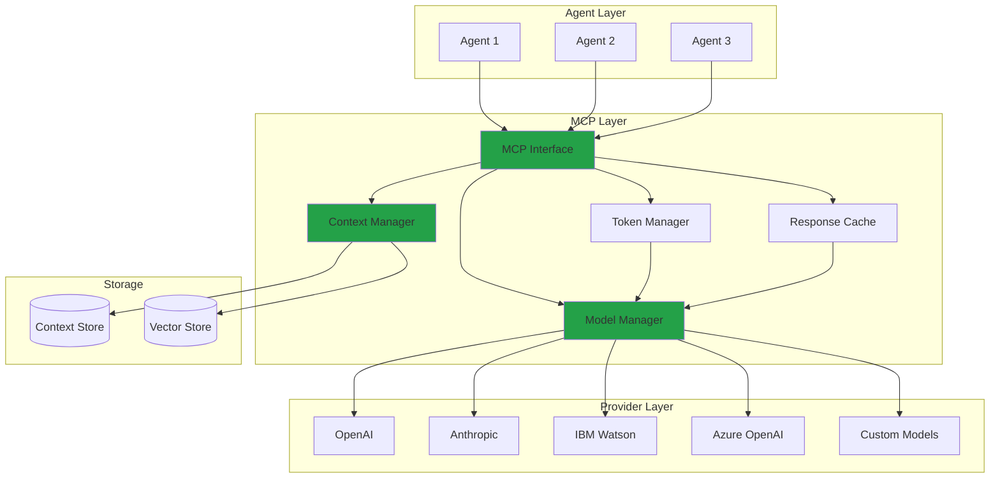

# Model Context Protocol (MCP)

## Overview

The **Model Context Protocol (MCP)** is a standardized protocol that enables AI agents to interact with Large Language Models (LLMs) and other AI services in a consistent, efficient manner. MCP abstracts the complexities of different model providers and provides a unified interface for context management, model invocation, and response handling.

## Purpose

MCP addresses several key challenges in AI agent development:

- **Provider Abstraction**: Work with multiple LLM providers through a single interface
- **Context Management**: Maintain conversation history and relevant context
- **State Persistence**: Preserve context across multiple interactions
- **Resource Optimization**: Efficient token usage and caching
- **Error Handling**: Standardized error responses and retry mechanisms

## Architecture



## Core Components

### 1. MCP Interface

The main entry point for agents to interact with AI models:

```python
from mcp import MCPClient

# Initialize MCP client
mcp = MCPClient(
    provider='openai',
    model='gpt-4',
    api_key=os.getenv('OPENAI_API_KEY')
)

# Send a request
response = mcp.complete(
    messages=[
        {"role": "system", "content": "You are a helpful assistant."},
        {"role": "user", "content": "What is the capital of France?"}
    ],
    context_id='conversation-123',
    temperature=0.7,
    max_tokens=150
)
```

### 2. Context Manager

Manages conversation history and context:

```python
# Create a new context
context = mcp.context.create(
    context_id='conversation-123',
    metadata={
        'user_id': 'user-456',
        'session_id': 'session-789'
    }
)

# Add messages to context
mcp.context.add_message(
    context_id='conversation-123',
    role='user',
    content='Tell me about AI agents'
)

# Retrieve context
history = mcp.context.get_history(
    context_id='conversation-123',
    limit=10
)
```

### 3. Model Manager

Handles model selection and invocation:

```python
# List available models
models = mcp.models.list()

# Get model capabilities
capabilities = mcp.models.get_capabilities('gpt-4')

# Switch models dynamically
mcp.models.set_default('claude-3-opus')
```

### 4. Token Manager

Optimizes token usage and manages costs:

```python
# Estimate tokens before sending
token_count = mcp.tokens.estimate(
    messages=messages,
    model='gpt-4'
)

# Get token usage statistics
usage = mcp.tokens.get_usage(
    context_id='conversation-123',
    period='last_24h'
)
```

## Protocol Specification

### Request Format

```json
{
  "version": "1.0",
  "context_id": "conversation-123",
  "model": "gpt-4",
  "messages": [
    {
      "role": "system",
      "content": "You are a helpful assistant."
    },
    {
      "role": "user",
      "content": "What is the capital of France?"
    }
  ],
  "parameters": {
    "temperature": 0.7,
    "max_tokens": 150,
    "top_p": 1.0,
    "frequency_penalty": 0.0,
    "presence_penalty": 0.0
  },
  "metadata": {
    "user_id": "user-456",
    "timestamp": "2026-01-15T11:42:00Z"
  }
}
```

### Response Format

```json
{
  "version": "1.0",
  "context_id": "conversation-123",
  "request_id": "req-abc123",
  "model": "gpt-4",
  "response": {
    "role": "assistant",
    "content": "The capital of France is Paris."
  },
  "usage": {
    "prompt_tokens": 25,
    "completion_tokens": 8,
    "total_tokens": 33
  },
  "metadata": {
    "latency_ms": 1250,
    "timestamp": "2026-01-15T11:42:01Z"
  }
}
```

### Error Format

```json
{
  "version": "1.0",
  "context_id": "conversation-123",
  "request_id": "req-abc123",
  "error": {
    "code": "RATE_LIMIT_EXCEEDED",
    "message": "Rate limit exceeded. Please try again later.",
    "retry_after": 60,
    "details": {
      "limit": 100,
      "remaining": 0,
      "reset_at": "2026-01-15T11:43:00Z"
    }
  }
}
```

## Features

### 1. Multi-Provider Support

Switch between providers seamlessly:

```python
# Use OpenAI
response = mcp.complete(
    provider='openai',
    model='gpt-4',
    messages=messages
)

# Use Anthropic
response = mcp.complete(
    provider='anthropic',
    model='claude-3-opus',
    messages=messages
)

# Use IBM Watson
response = mcp.complete(
    provider='ibm-watson',
    model='granite-13b',
    messages=messages
)
```

### 2. Context Persistence

Maintain context across sessions:

```python
# Save context
mcp.context.save(
    context_id='conversation-123',
    storage='persistent'
)

# Load context later
mcp.context.load(
    context_id='conversation-123'
)

# Resume conversation
response = mcp.complete(
    context_id='conversation-123',
    messages=[{"role": "user", "content": "Continue our discussion"}]
)
```

### 3. Streaming Responses

Handle streaming for real-time responses:

```python
# Stream response
for chunk in mcp.stream(
    messages=messages,
    context_id='conversation-123'
):
    print(chunk.content, end='', flush=True)
```

### 4. Function Calling

Enable agents to call functions:

```python
# Define functions
functions = [
    {
        "name": "get_weather",
        "description": "Get current weather for a location",
        "parameters": {
            "type": "object",
            "properties": {
                "location": {"type": "string"},
                "unit": {"type": "string", "enum": ["celsius", "fahrenheit"]}
            },
            "required": ["location"]
        }
    }
]

# Request with functions
response = mcp.complete(
    messages=messages,
    functions=functions,
    context_id='conversation-123'
)

# Handle function call
if response.function_call:
    result = execute_function(
        response.function_call.name,
        response.function_call.arguments
    )
```

### 5. Embeddings

Generate embeddings for semantic search:

```python
# Generate embeddings
embeddings = mcp.embeddings.create(
    input="AI agents are autonomous software entities",
    model="text-embedding-ada-002"
)

# Store in vector database
mcp.embeddings.store(
    embeddings=embeddings,
    metadata={"source": "documentation"},
    collection="knowledge-base"
)

# Semantic search
results = mcp.embeddings.search(
    query="What are AI agents?",
    collection="knowledge-base",
    limit=5
)
```

## Best Practices

### 1. Context Management

- Keep context size manageable (< 8K tokens for most models)
- Implement context summarization for long conversations
- Clear old contexts regularly to save storage

### 2. Error Handling

```python
from mcp.exceptions import RateLimitError, ModelError

try:
    response = mcp.complete(messages=messages)
except RateLimitError as e:
    # Wait and retry
    time.sleep(e.retry_after)
    response = mcp.complete(messages=messages)
except ModelError as e:
    # Log error and use fallback
    logger.error(f"Model error: {e}")
    response = fallback_response()
```

### 3. Token Optimization

- Use appropriate max_tokens limits
- Implement response caching for repeated queries
- Monitor token usage and costs

### 4. Security

- Never log API keys or sensitive data
- Validate and sanitize user inputs
- Implement rate limiting per user/session

## Integration with IBM Orchestrate

MCP integrates seamlessly with IBM Orchestrate:

```python
from orchestrate import OrchestratePlatform
from mcp import MCPClient

# Initialize both
orchestrate = OrchestratePlatform(...)
mcp = MCPClient(...)

# Register MCP as a service
orchestrate.register_service(
    name='mcp-service',
    service=mcp,
    health_check=mcp.health_check
)

# Use in workflows
workflow = orchestrate.create_workflow(
    name='ai-conversation',
    steps=[
        {
            'name': 'process-input',
            'service': 'mcp-service',
            'method': 'complete',
            'input': '${user.message}'
        }
    ]
)
```

## Resources

- [MCP Specification](https://modelcontextprotocol.io/)
- [API Reference](../api/reference.md)
- [A2A Protocol](a2a.md)
- [Architecture Overview](../architecture/overview.md)