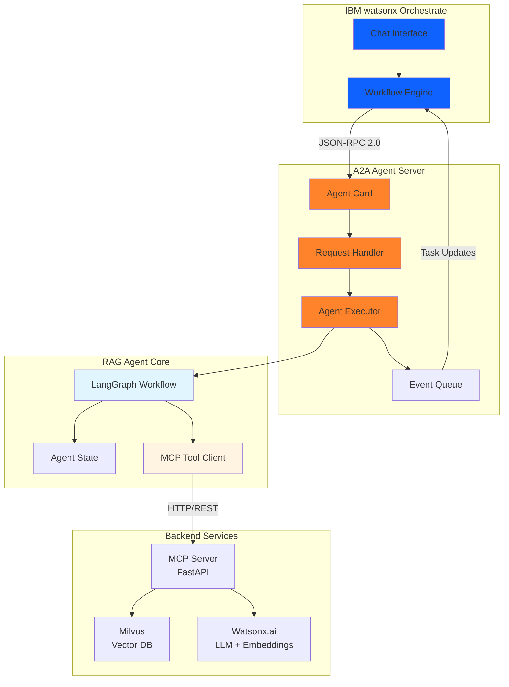
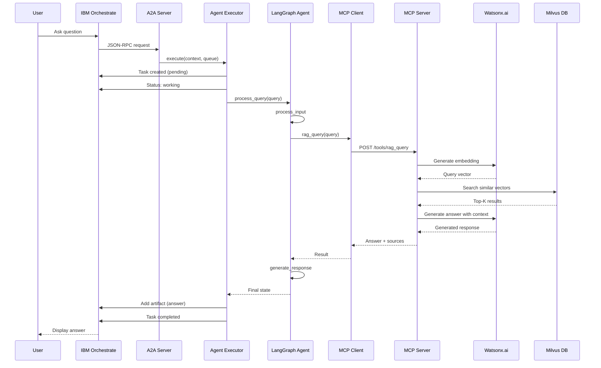

# A2A RAG Agent Overview

The A2A RAG Agent is a production-ready Retrieval-Augmented Generation system that integrates with IBM watsonx Orchestrate using the **A2A 0.3.0 protocol**. It combines LangGraph workflows, MCP tools, and watsonx.ai to provide intelligent query services over a knowledge base.

## Architecture



## Key Components

### 1. A2A Agent Server
- **Purpose**: Provides A2A 0.3.0 protocol compliance for Orchestrate integration
- **Technology**: `a2a-server` framework with Starlette
- **Components**:
  - **Agent Card**: Describes agent capabilities at `/.well-known/agent-card.json`
  - **Request Handler**: Processes JSON-RPC 2.0 requests from Orchestrate
  - **Agent Executor**: Implements task execution logic
  - **Event Queue**: Sends real-time task updates to Orchestrate

### 2. LangGraph Workflow
- **Purpose**: Orchestrates RAG operations using state machine patterns
- **Technology**: LangGraph for workflow management
- **Workflow Nodes**:
  - `process_input`: Validates and prepares user query
  - `retrieve_context`: Fetches relevant context from knowledge base
  - `generate_response`: Finalizes response with metadata
  - `handle_error`: Manages error conditions
- **Features**:
  - Asynchronous processing
  - Conditional routing based on state
  - Error handling and recovery
  - Conversation history tracking

### 3. MCP Tool Client
- **Purpose**: Communicates with MCP server for RAG operations
- **Technology**: httpx AsyncClient
- **Methods**:
  - `rag_query()`: Query with LLM generation
  - `rag_search()`: Semantic search only
  - `rag_index()`: Index documents
  - `rag_stats()`: Knowledge base statistics
  - `health_check()`: Service health verification

### 4. MCP Server (FastAPI)
- **Purpose**: Exposes RAG operations as RESTful API endpoints
- **Technology**: FastAPI with Pydantic validation
- **Endpoints**:
  - `POST /tools/rag_query` - Query with LLM generation
  - `POST /tools/rag_search` - Semantic search only
  - `POST /tools/rag_index` - Index documents
  - `GET /tools/rag_stats` - Knowledge base statistics
  - `GET /health` - Health check

### 5. Watsonx.ai Integration
- **Purpose**: Provides AI capabilities
- **Models**:
  - **Embeddings**: `ibm/granite-embedding-278m-multilingual` (768 dimensions)
  - **LLM**: `openai/gpt-oss-120b` (16384 max tokens)
- **Features**:
  - Multilingual semantic embeddings
  - Context-aware response generation
  - Retry logic with exponential backoff

### 6. Milvus Vector Store
- **Purpose**: High-performance vector similarity search
- **Configuration**:
  - Metric: COSINE similarity
  - Index: IVF_FLAT
  - Dimension: 768 (matches embedding model)
- **Deployment**: Podman containerized

## Complete Request Flow



## Features

### Document Processing
- **Supported Formats**: PDF, DOCX, TXT, Markdown
- **Chunking Strategy**: 
  - Configurable chunk size (default: 300 tokens)
  - Overlap for context preservation (default: 40 tokens)
- **Metadata**: Source tracking, chunk indexing, timestamps

### Semantic Search
- **Vector Similarity**: COSINE metric for relevance
- **Configurable Top-K**: Retrieve 1-20 most relevant chunks
- **Score Threshold**: Filter low-relevance results (default: 0.7)

### Response Generation
- **Context-Aware**: Uses retrieved chunks as context
- **Source Attribution**: Includes source documents and scores
- **Streaming Support**: Real-time response generation

## Agent State Management

The agent uses TypedDict for state management:

```python
class AgentState(TypedDict):
    """State for the A2A RAG agent."""
    query: str                              # User query
    messages: List[Dict[str, str]]          # Conversation history
    context: Optional[List[str]]            # Retrieved context chunks
    sources: Optional[List[Dict[str, Any]]] # Source information
    response: Optional[str]                 # Generated response
    metadata: Optional[Dict[str, Any]]      # Additional metadata
    error: Optional[str]                    # Error message if any
    next_action: Optional[str]              # Next workflow action
```

## Performance Characteristics

| Metric | Value | Notes |
|--------|-------|-------|
| Document Indexing | ~0.37s for 196K lines | Shakespeare complete works |
| Query Response Time | < 5 seconds | Including LLM generation and Orchestrate overhead |
| Concurrent Queries | 10+ simultaneous | Tested with async handling |
| Vector Search | < 1 second | Average search time |
| Memory Usage | < 2GB | For typical workloads |
| A2A Protocol Overhead | < 100ms | Task management and updates |

## Integration with IBM watsonx Orchestrate

### Registration

```bash
orchestrate agents create \
  -n shakespeare-rag-agent \
  -t "Shakespeare Knowledge Agent" \
  -k external \
  --description "RAG agent with complete works of Shakespeare" \
  --api http://host.lima.internal:8001 \
  --provider external_chat/A2A/0.3.0
```

### Usage

Once registered, the agent can be:
- Invoked through Orchestrate's chat interface
- Included in multi-agent workflows
- Called by other agents via A2A protocol
- Monitored through Orchestrate's observability tools

## Use Cases

### 1. Literary Analysis
- **Shakespeare Knowledge Base**: Complete works of Shakespeare indexed
- **Character Analysis**: Questions about characters, relationships, themes
- **Quote Attribution**: Find and attribute famous quotes
- **Plot Summaries**: Understand play structures and storylines

### 2. Educational Applications
- **Student Research**: Help students understand Shakespeare's works
- **Teaching Aid**: Provide context and analysis for educators
- **Comparative Analysis**: Compare themes across different plays
- **Historical Context**: Understand Elizabethan era references

### 3. Content Creation
- **Writing Inspiration**: Find relevant quotes and passages
- **Script Development**: Reference authentic Shakespearean language
- **Literary References**: Verify quotes and attributions
- **Theme Exploration**: Discover related content across works

### 4. Enterprise Knowledge Management
- **Document Q&A**: Adapt for corporate documentation
- **Policy Retrieval**: Answer questions about policies and procedures
- **Technical Documentation**: Index and query technical manuals
- **Research Repositories**: Search academic papers and research

## Getting Started

See the [Quick Start Guide](quickstart.md) for installation and setup instructions.

For detailed API documentation, see [API Reference](api-reference.md).

For testing information, see [Testing Guide](testing.md).