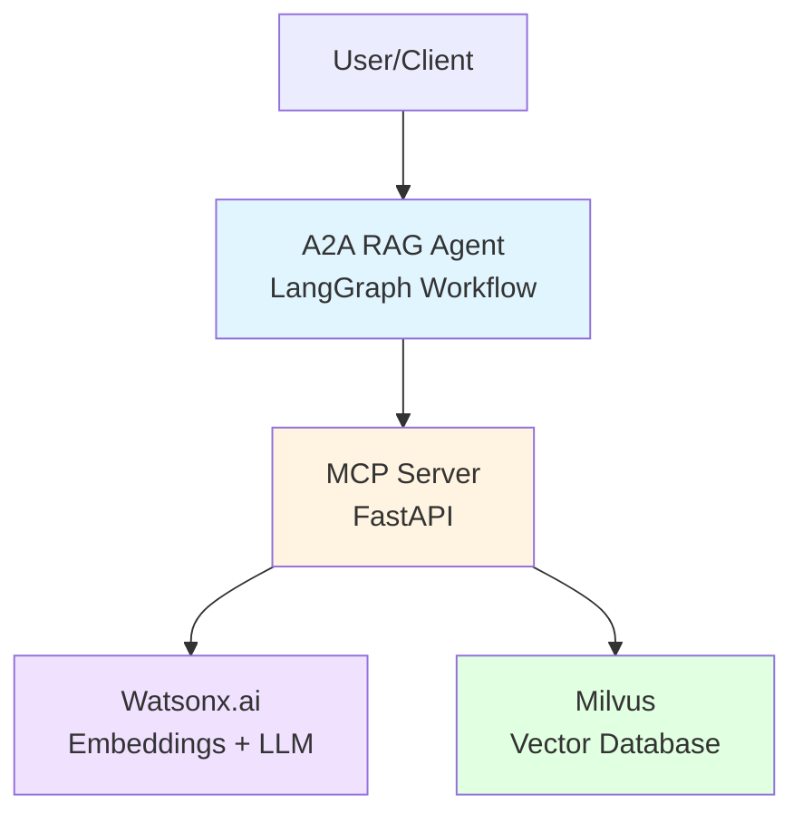
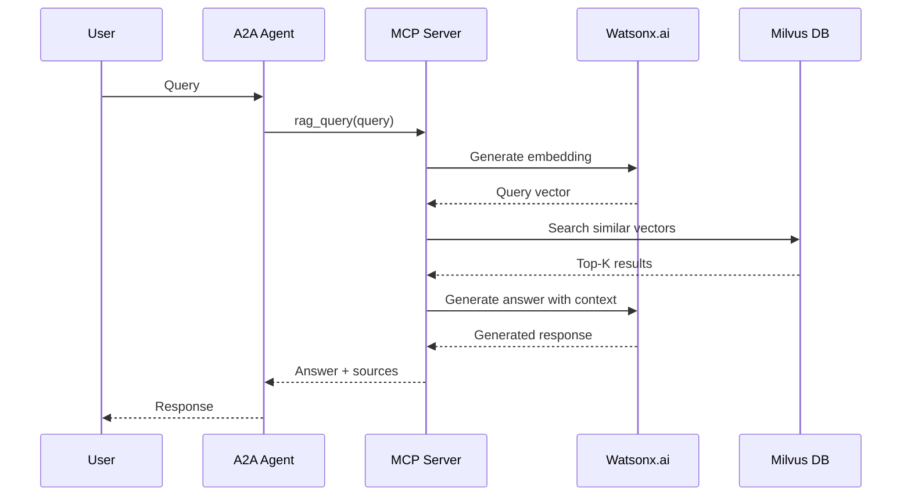

# A2A RAG Agent Overview

The A2A RAG Agent is a production-ready Retrieval-Augmented Generation system that combines the Agent-to-Agent (A2A) protocol with Model Context Protocol (MCP) tools to provide intelligent query services over a knowledge base.

## Architecture

## Key Components

### 1. A2A Agent (LangGraph)
- **Purpose**: Orchestrates RAG workflows using state machine patterns
- **Technology**: LangGraph for workflow management
- **Features**:
  - Asynchronous processing
  - Error handling and retry logic
  - A2A protocol message handling
  - Conversation history management

### 2. MCP Server (FastAPI)
- **Purpose**: Exposes RAG operations as RESTful API endpoints
- **Technology**: FastAPI with Pydantic validation
- **Endpoints**:
  - `/tools/rag_query` - Query with LLM generation
  - `/tools/rag_search` - Semantic search only
  - `/tools/rag_index` - Index documents
  - `/tools/rag_stats` - Knowledge base statistics
  - `/health` - Health check

### 3. Watsonx.ai Integration
- **Purpose**: Provides AI capabilities
- **Models**:
  - **Embeddings**: `ibm/granite-embedding-278m-multilingual` (768 dimensions)
  - **LLM**: `openai/gpt-oss-120b` (16384 max tokens)
- **Features**:
  - Multilingual semantic embeddings
  - Context-aware response generation
  - Retry logic with exponential backoff

### 4. Milvus Vector Store
- **Purpose**: High-performance vector similarity search
- **Configuration**:
  - Metric: COSINE similarity
  - Index: IVF_FLAT
  - Dimension: 768 (matches embedding model)
- **Deployment**: Podman/Docker containerized

## RAG Pipeline Flow

## Features

### Document Processing
- **Supported Formats**: PDF, DOCX, TXT, Markdown
- **Chunking Strategy**: 
  - Configurable chunk size (default: 300 tokens)
  - Overlap for context preservation (default: 40 tokens)
- **Metadata**: Source tracking, chunk indexing, timestamps

### Semantic Search
- **Vector Similarity**: COSINE metric for relevance
- **Configurable Top-K**: Retrieve 1-20 most relevant chunks
- **Score Threshold**: Filter low-relevance results (default: 0.7)

### Response Generation
- **Context-Aware**: Uses retrieved chunks as context
- **Source Attribution**: Includes source documents and scores
- **Streaming Support**: Real-time response generation

## Performance Characteristics

| Metric | Value | Notes |
|--------|-------|-------|
| Document Indexing | ~0.37s for 196K lines | Shakespeare complete works |
| Query Response Time | < 5 seconds | Including LLM generation |
| Concurrent Queries | 10+ simultaneous | Tested with async handling |
| Vector Search | < 1 second | Average search time |
| Memory Usage | < 2GB | For typical workloads |

## Use Cases

### 1. Technical Documentation Q&A
- Index product documentation, API references, user guides
- Answer technical questions with source citations
- Maintain up-to-date knowledge base

### 2. Knowledge Management
- Corporate knowledge bases
- Research paper repositories
- Policy and procedure documents

### 3. Customer Support
- FAQ automation
- Ticket resolution assistance
- Product information retrieval

### 4. Content Discovery
- Semantic search across large document collections
- Related content recommendations
- Topic exploration

## Getting Started

See the [Quick Start Guide](quickstart.md) for installation and setup instructions.

For detailed API documentation, see [API Reference](api-reference.md).

For testing information, see [Testing Guide](testing.md).